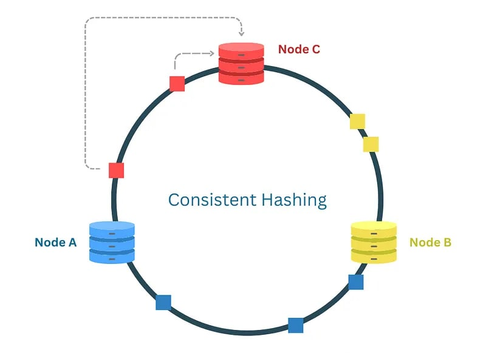

+++
category = []
date = 2024-05-23T00:00:00Z
description = "Day 80: From Concept to Code: Implementing a Dummy Consistent Hashing in Java using TreeMap"
draft = false
ShowToc = true
TocOpen = true
slug = "posts/java/100DaysOfJava/day80 "
summary = "Implementing a Dummy Consistent Hashing in Java using TreeMap and Hash Function"
title = "Day 80: From Concept to Code: Implementing a Dummy Consistent Hashing in Java using TreeMap"
[cover]
alt = "day80"
caption = "day80"
image = ""
relative = false

+++

As a software engineer working with distributed systems, ensuring efficient data distribution across nodes is crucial. Consistent hashing offers a robust solution for this challenge. This blog post will delve into a Java implementation of consistent hashing with unit tests, along with the key concepts and design decisions involved.

## Understanding Consistent Hashing
Traditional hashing techniques often result in significant rehashing of keys when nodes are added or removed. Consistent hashing mitigates this by ensuring that only a small subset of keys are remapped. This property makes it highly suitable for scalable and fault-tolerant distributed systems.

## Key Concepts



### Hash Function
A Hash Function is a mathematical algorithm that takes an input (or 'message') and returns a fixed-size string of bytes. The output is typically a hash code or hash value. The primary purpose of a hash function is to map data of arbitrary size to data of a fixed size. In the context of consistent hashing, the hash function is used to assign both data keys and node identifiers to positions on the hash ring.

The effectiveness of a hash function in consistent hashing depends on its ability to uniformly distribute the keys across the hash ring, minimizing the chances of collisions where two different inputs produce the same hash value. A good hash function ensures that the keys are spread evenly, which leads to efficient load balancing among nodes.

### Hash Ring
The Hash Ring is a conceptual circular space that represents the range of possible hash values produced by the hash function. Imagine a circle where the hash values wrap around, creating a continuous loop. Both nodes (servers, caches, etc.) and data keys are hashed and placed on this ring.

When placing a data key on the ring, the system looks for the nearest node in the clockwise direction. This node is responsible for storing that key. The circular nature of the hash ring ensures that every key has a node assignment, and it allows for a smooth transition when nodes are added or removed. By using a circular space, consistent hashing efficiently handles node dynamics with minimal data reshuffling.

### Virtual Nodes
Virtual Nodes (or "vnodes") are logical subdivisions of physical nodes in the hash ring. Instead of each physical node being represented by a single point on the ring, it can be represented by multiple virtual nodes. Each virtual node is assigned a unique position on the hash ring.

Virtual nodes enhance the distribution of keys across the physical nodes, especially when there are a small number of physical nodes. They help achieve a more balanced load by mitigating the effects of uneven key distribution and ensuring that no single physical node becomes a bottleneck. When a physical node is added or removed, only the virtual nodes associated with that physical node need to be redistributed, leading to better fault tolerance and load balancing.

### Replication
Replication in the context of consistent hashing refers to the practice of placing multiple copies of each node on the hash ring to ensure better distribution and fault tolerance. This is controlled by the numberOfReplicas parameter in our implementation.

By replicating nodes, we can distribute the keys more evenly across the hash ring. Each physical node is represented by several points (virtual nodes), and each point can independently take responsibility for a portion of the data. This approach also enhances fault tolerance: if a physical node fails, its virtual nodes can be easily reassigned to other physical nodes, ensuring that the data remains accessible. Replication minimizes the impact of node failures and ensures that the system can continue to function smoothly even when changes occur.

### Problems Solved by Consistent Hashing
#### Scalability:

Allows the system to scale easily by adding or removing nodes with minimal impact on data distribution.

#### Load Balancing:

Distributes data evenly across nodes, preventing any single node from becoming a bottleneck.

#### Fault Tolerance:

Reduces the risk of data loss by redistributing data automatically when nodes fail.

### Implementing Consistent Hashing in Java
We begin by defining the ConsistentHashing class. This class includes methods to add and remove nodes and to find the corresponding node for a given key. We use the SHA-256 algorithm for hashing to ensure a good distribution of hash values.

At first here I am considering 

- Weighted Nodes: Each node's capacity is taken into account by adjusting the number of virtual nodes based on the node's capacity. Nodes with higher capacities have more virtual nodes, ensuring a more balanced load distribution.
- Dynamic Node Management: Methods to add and remove nodes dynamically, taking into account the node capacities and redistributing data as needed.
- Replication and Quorum: Ensures data availability and consistency by writing to a quorum of nodes and reading from a quorum of nodes, even in the presence of node failures or removals.
This enhanced implementation ensures that nodes with different capacities are effectively utilized, leading to a more balanced and efficient distributed system.

To implement this I am using a TreeMap. which uses the Red-Black tree inside it. Lets understand it a little bit.

### Key Characteristics of TreeMap
#### Ordered: 

TreeMap maintains its elements in ascending order, according to the natural ordering of its keys or by a comparator provided at map creation time.

#### NavigableMap Features: 
It provides several methods to navigate the map, such as firstKey, lastKey, lowerKey, higherKey, subMap, headMap, and tailMap.

### Internal Working

#### Red-Black Tree: 
Internally, TreeMap uses a Red-Black tree, which is a self-balancing binary search tree. This ensures that the tree remains balanced, and the operations can be performed in logarithmic time.

#### Node Structure: Each node in the tree contains:

- Key
- Value
- References to the left child, right child, and parent nodes
- A color attribute (red or black) to maintain balance according to Red-Black tree properties


### Key Characteristics of Red-Black tree

A Red-Black Tree is a type of self-balancing binary search tree. Each node in the tree contains an extra bit for storing its color, which can be either red or black. The color attribute helps maintain the balance of the tree during insertions and deletions. Here’s a detailed explanation:

Key Properties of Red-Black Trees
Binary Search Tree Property: Like all binary search trees (BST), for each node, the value of the left child is less than its value, and the value of the right child is greater.

Red-Black Properties:

- Property 1: Each node is either red or black.
- Property 2: The root node is always black.
- Property 3: All leaves (NIL nodes) are black. These are the null children of a leaf node, considered black for simplicity in maintaining tree properties.
- Property 4: If a red node has children, then the children are always black (no two red nodes can be adjacent).
- Property 5: Every path from a given node to any of its descendant leaves has the same number of black nodes (black-height).

Now let us see the use case of TreeMap to implement a Dummy consistent hashing

```java
public class ConsistentHashingWithWeightedNodes {
    private final SortedMap<Integer, String> ring = new TreeMap<>();
    private final Map<String, Integer> nodeCapacities = new HashMap<>();
    private final int replicationFactor;
    private final int writeQuorum;
    private final int readQuorum;
    private final Map<String, Map<String, String>> dataStore = new HashMap<>();
    private final MessageDigest md5;
```
This defines the `ConsistentHashingWithWeightedNodes` class with the following fields:
- `ring`: A `SortedMap` to represent the consistent hashing ring.
- `nodeCapacities`: A `Map` to store each node's capacity.
- `replicationFactor`: Number of replicas for each data item.
- `writeQuorum`: Minimum number of nodes that must acknowledge a write for it to be considered successful.
- `readQuorum`: Minimum number of nodes that must be contacted to successfully read data.
- `dataStore`: A nested `Map` to store the actual data on each node.
- `md5`: An instance of `MessageDigest` for computing MD5 hashes.

```java
    public ConsistentHashingWithWeightedNodes(Map<String, Integer> nodes, int replicationFactor, int writeQuorum, int readQuorum) throws NoSuchAlgorithmException {
        this.md5 = MessageDigest.getInstance("MD5");
        this.replicationFactor = replicationFactor;
        this.writeQuorum = writeQuorum;
        this.readQuorum = readQuorum;

```
This is the constructor of the ConsistentHashingWithWeightedNodes class. It initializes the md5 instance for hashing and sets the replication factor, write quorum, and read quorum.

```java
        for (Map.Entry<String, Integer> entry : nodes.entrySet()) {
            addNode(entry.getKey(), entry.getValue());
        }
    }
```
The constructor adds all nodes from the input `nodes` map, which contains node names and their respective capacities, to the consistent hashing ring using the `addNode` method.

```java
    private int hash(String key) {
        md5.update(key.getBytes());
        byte[] digest = md5.digest();
        return ByteBuffer.wrap(digest).getInt();
    }
```
This method computes the MD5 hash of a given key and converts it to an integer. The hash value is used to place nodes and data on the consistent hashing ring.
Here the ByteBuffer is used for getting the output of digest array to an interger. 

Let’s say the digest array contains the following bytes (in hexadecimal):

```java
digest = {0x12, 0x34, 0x56, 0x78, ...};
```

When you call `ByteBuffer.wrap(digest).getInt()` the following steps occur:

##### Wrap the Byte Array:

ByteBuffer.wrap(digest) creates a ByteBuffer that points to the digest array.

##### Read an Integer:

getInt() reads the first four bytes: 0x12, 0x34, 0x56, 0x78. Since ByteBuffer uses big-endian order, these bytes are interpreted as the integer:0x12345678

In decimal, this value is 305419896.

So, the line ByteBuffer.wrap(digest).getInt() effectively converts the first four bytes of the digest array into an integer in a straightforward and readable manner.

#### Usage in Context
In the context of the hash function, this conversion is used to transform the MD5 hash (which is a 16-byte array) into a single integer value. This integer value is then used to place nodes and keys on the consistent hashing ring.

```java
    public void addNode(String node, int capacity) {
        nodeCapacities.put(node, capacity);
        int virtualNodes = capacity; // Use capacity directly as the number of virtual nodes for simplicity
```
The `addNode` method adds a node to the consistent hashing ring. The number of virtual nodes for this node is determined by its capacity.

```java
        for (int i = 0; i < virtualNodes; i++) {
            int hash = hash(node + "#" + i);
            ring.put(hash, node);
        }
    }
```
For each virtual node, the method computes its hash and adds it to the ring.

```java
    public void removeNode(String node) {
        int virtualNodes = nodeCapacities.get(node);
```
The `removeNode` method removes a node and its virtual nodes from the ring. It first retrieves the number of virtual nodes based on the node's capacity.

```java
        for (int i = 0; i < virtualNodes; i++) {
            int hash = hash(node + "#" + i);
            ring.remove(hash);
        }
        
        nodeCapacities.remove(node);
    }
```
It then removes each virtual node from the ring and finally removes the node from the `nodeCapacities` map.

```java
    private List<String> getNodesForKey(String key) {
        List<String> nodes = new ArrayList<>();
        int hash = hash(key);
        SortedMap<Integer, String> tailMap = ring.tailMap(hash);
```
The `getNodesForKey` method determines which nodes should store a given key. It first computes the hash of the key and finds the relevant segment in the ring.

```java
        for (Map.Entry<Integer, String> entry : tailMap.entrySet()) {
            if (!nodes.contains(entry.getValue())) {
                nodes.add(entry.getValue());
                if (nodes.size() == replicationFactor) {
                    return nodes;
                }
            }
        }
```
It iterates through the tail map (the part of the ring starting from the key's hash) and adds nodes to the list until the replication factor is met.

```java
        for (Map.Entry<Integer, String> entry : ring.entrySet()) {
            if (!nodes.contains(entry.getValue())) {
                nodes.add(entry.getValue());
                if (nodes.size() == replicationFactor) {
                    break;
                }
            }
        }

        return nodes;
    }
```
If the tail map does not contain enough nodes, it continues from the beginning of the ring until it has enough nodes to meet the replication factor.

```java
    public boolean writeData(String key, String value) {
        List<String> nodes = getNodesForKey(key);
        int successCount = 0;
        for (String node : nodes) {
            if (writeToNode(node, key, value)) {
                successCount++;
                if (successCount >= writeQuorum) {
                    return true;
                }
            }
        }
        return false;
    }
```
The `writeData` method writes data to the nodes responsible for the key. It retrieves the nodes using `getNodesForKey` and writes to each node until the write quorum is met.

```java
    private boolean writeToNode(String node, String key, String value) {
        if (!dataStore.containsKey(node)) {
            dataStore.put(node, new HashMap<>());
        }
        dataStore.get(node).put(key, value);
        return true;
    }
```
The `writeToNode` method actually writes the key-value pair to the node's data store. If the node does not already have a data store, it creates one.

```java
    public String readData(String key) {
        List<String> nodes = getNodesForKey(key);
        Map<String, Integer> valueCounts = new HashMap<>();
        for (String node : nodes) {
            String value = readFromNode(node, key);
            if (value != null) {
                valueCounts.put(value, valueCounts.getOrDefault(value, 0) + 1);
                if (valueCounts.get(value) >= readQuorum) {
                    return value;
                }
            }
        }
        return "No Data Found";
    }
```
The `readData` method reads data for a given key from the responsible nodes. It counts the occurrences of each value read and returns the value if it meets the read quorum.

```java
    private String readFromNode(String node, String key) {
        if (dataStore.containsKey(node)) {
            return dataStore.get(node).get(key);
        }
        return null;
    }
```
The `readFromNode` method retrieves the value for a key from a specific node's data store.

```java
    public static void main(String[] args) throws NoSuchAlgorithmException {
        Map<String, Integer> nodes = new HashMap<>();
        nodes.put("Node1", 1); // Capacity 1
        nodes.put("Node2", 3); // Capacity 3
        nodes.put("Node3", 2); // Capacity 2

        int replicationFactor = 3;
        int writeQuorum = 2;
        int readQuorum = 2;

        ConsistentHashingWithWeightedNodes ch = new ConsistentHashingWithWeightedNodes(nodes, replicationFactor, writeQuorum, readQuorum);

        System.out.println("Writing data...");
        System.out.println("Write key1: " + ch.writeData("key1", "value1"));
        System.out.println("Write key2: " + ch.writeData("key2", "value2"));
        System.out.println("Write key3: " + ch.writeData("key3", "value3"));

        System.out.println("Reading data...");
        System.out.println("Read key1: " + ch.readData("key1"));
        System.out.println("Read key2: " + ch.readData("key2"));
        System.out.println("Read key3: " + ch.readData("key3"));

        ch.addNode("Node4", 5); // Adding a new node with higher capacity
        System.out.println("Write key4 after adding Node4: " + ch.writeData("key4", "value4"));

        ch.removeNode("Node2");
        System.out.println("Read key2 after removing Node2: " + ch.readData("key2"));
    }
}
```
The `main` method demonstrates the usage of the `ConsistentHashingWithWeightedNodes` class. It:
1. Creates a map of nodes with different capacities.
2. Initializes the consistent hashing ring with these nodes.
3. Writes some data and prints the results.
4. Reads the data


Here I discussed about Replication Factor and Quorum. Will discuss them in details in some later post. For now posting some resource for further learning consistent hashing, Red-Black tree, Replication and Quorum.

## Consistent Hashing : 
1. https://medium.com/codex/understanding-and-implementing-consistent-hash-algorithm-e53a35afa428
2. https://rmarcus.info/blog/2018/09/14/consistent-hashing-overflow.html

## Red-Black Tree :
1. https://zarif98sjs.github.io/blog/blog/redblacktree/
2. https://stackoverflow.com/questions/31779786/how-tree-map-uses-red-black-tree-algorithm

## Replication In the context of Consistent hashing :
1. https://dev.to/arslan_ah/how-to-use-consistent-hashing-in-a-system-design-interview-33ge
2. https://www.geeksforgeeks.org/what-is-replication-in-consistent-hashing/

## Quorum :
1. https://systemdesign.one/consistency-patterns/?ref=highscalability.com
2. https://code.likeagirl.io/distributed-computing-quorum-consistency-in-replication-96e64f7b5c6