+++
category = ["Java", "100DaysOfJava"]
date = 2025-11-21T00:00:00Z
description = "Master advanced Java concurrency - CyclicBarrier, Phaser, Semaphore, ReentrantLock, BlockingQueue, DelayQueue, and ThreadFactory with production patterns, trade-offs, and debugging techniques."
draft = false
ShowToc = true
TocOpen = true
slug = "posts/java/100DaysOfJava/day96"
summary = "Part 2: Synchronization & Advanced Patterns - Deep dive into 7 essential concurrency tools with real-world patterns, performance characteristics, and common pitfalls"
title = "Day 96: Java Concurrency Toolkit Part 2 - Synchronization & Advanced Patterns"
[cover]
alt = "day96"
caption = "day96"
image = ""
relative = false
+++

**"The art of concurrent programming lies not in making things parallel, but in coordinating parallel things gracefully."**

In [Part 1 (Day 95)](/posts/java/100DaysOfJava/day95), we explored the **foundation and execution patterns**: Executor, ExecutorService, ScheduledExecutorService, Future, CompletableFuture, and CountDownLatch. These tools help us execute tasks concurrently.

Now in **Part 2**, we dive into **synchronization and advanced coordination patterns**—the tools that help multiple threads work together without chaos.

## What We're Covering Today

**Part 2 (Today):** Synchronization & Advanced Patterns
1. CyclicBarrier - Reusable multi-phase synchronization
2. Semaphore - Resource pool management
3. ThreadFactory - Production-ready thread management
4. BlockingQueue - Producer-consumer patterns
5. DelayQueue - Time-delayed execution
6. ReentrantLock - Fine-grained locking
7. Phaser - Dynamic multi-phase coordination

---

## Performance Characteristics Reference

| Tool | CPU Overhead | Memory Per Instance | Typical Latency | Best For |
|------|-------------|---------------------|-----------------|----------|
| **CyclicBarrier** | Low | ~80 bytes + parties | Microseconds (coordination) | Fixed-party multi-phase work |
| **Semaphore** | Very Low | ~32 bytes | Nanoseconds | Resource limiting |
| **ThreadFactory** | Zero (creation time) | Per thread (~1MB stack) | N/A | Thread customization |
| **BlockingQueue** | Low-Medium | Depends on capacity | Microseconds (ops) | Producer-consumer |
| **DelayQueue** | Medium | ~200 bytes + heap | Milliseconds (granularity) | Scheduled/delayed work |
| **ReentrantLock** | Very Low | ~48 bytes | Nanoseconds | Fine-grained locking |
| **Phaser** | Medium | ~128 bytes + parties | Microseconds | Dynamic phase coordination |

---

## The Coordination Challenge

In Part 1, we learned how to execute work concurrently. But execution alone isn't enough. Real systems need **coordination**:


Think of it like a construction project:
- Workers need to sync at checkpoints (CyclicBarrier)
- Only X workers can use the crane at once (Semaphore)
- Workers need proper uniforms and tools (ThreadFactory)
- Materials move between stations (BlockingQueue)
- Some tasks must wait for concrete to dry (DelayQueue)
- Critical areas need access control (ReentrantLock)
- Team size changes during project (Phaser)

---

## 1. CyclicBarrier: Multi-Phase Processing

**The Problem:** Processing a large dataset in three phases: Extract → Transform → Load. Each phase must complete across all threads before the next phase starts.

This is perfect for batch processing scenarios where work happens in distinct phases. Unlike CountDownLatch which is one-shot, CyclicBarrier resets after each phase, making it ideal for iterative workflows.

**The Solution:** Synchronized phase transitions with CyclicBarrier.

```java
import java.util.concurrent.*;
import java.util.stream.IntStream;

public class BatchProcessor {
    private final int workerCount;
    
    public BatchProcessor(int workerCount) {
        this.workerCount = workerCount;
    }
    
    public void processBatch() throws InterruptedException {
        CyclicBarrier barrier = new CyclicBarrier(
            workerCount,
            () -> System.out.println("--- Phase completed. All workers synchronized ---")
        );
        
        ExecutorService pool = Executors.newFixedThreadPool(workerCount);
        
        Runnable worker = () -> {
            try {
                String threadName = Thread.currentThread().getName();
                
                // Phase 1: Extract
                System.out.println(threadName + " - Extracting data...");
                Thread.sleep(ThreadLocalRandom.current().nextInt(500, 1500));
                System.out.println(threadName + " - Extract complete");
                
                barrier.await(); // Wait for all threads to finish Phase 1
                
                // Phase 2: Transform
                System.out.println(threadName + " - Transforming data...");
                Thread.sleep(ThreadLocalRandom.current().nextInt(500, 1500));
                System.out.println(threadName + " - Transform complete");
                
                barrier.await(); // Wait for all threads to finish Phase 2
                
                // Phase 3: Load
                System.out.println(threadName + " - Loading data...");
                Thread.sleep(ThreadLocalRandom.current().nextInt(500, 1500));
                System.out.println(threadName + " - Load complete");
                
                barrier.await(); // Wait for all threads to finish Phase 3
                
            } catch (InterruptedException | BrokenBarrierException e) {
                System.err.println("Worker interrupted: " + e.getMessage());
            }
        };
        
        // Submit all workers
        IntStream.range(0, workerCount)
                .forEach(i -> pool.submit(worker));
        
        pool.shutdown();
        pool.awaitTermination(1, TimeUnit.MINUTES);
        
        System.out.println("Batch processing complete!");
    }
}
```

**Key Difference from CountDownLatch:** CyclicBarrier is reusable. After all threads reach the barrier, it resets automatically. Perfect for iterative or phase-based processing.

### Visualizing CyclicBarrier
here is a sequence diagram to visualize how `Cyclic Barrier` works.


### Trade-offs and Limitations

**Pros:**
- Reusable (unlike CountDownLatch)
- Built-in barrier action (callback when all arrive)
- Low overhead
- Thread-safe reset

**Cons:**
- Fixed number of parties (must be known at creation)
- If one thread fails, others wait forever (unless you handle BrokenBarrierException)
- No dynamic party registration (use Phaser instead)
- All threads must reach barrier together (can't have stragglers)

**Common Mistakes:**

```java
// MISTAKE 1: Wrong party count
CyclicBarrier barrier = new CyclicBarrier(5);
for (int i = 0; i < 3; i++) { // Only 3 threads!
    pool.submit(() -> {
        doWork();
        barrier.await(); // Blocks forever! Only 3/5 arrived
    });
}

// ✅ CORRECT: Match party count
int parties = 3;
CyclicBarrier barrier = new CyclicBarrier(parties);
for (int i = 0; i < parties; i++) {
    pool.submit(() -> {
        doWork();
        barrier.await();
    });
}

// ❌ MISTAKE 2: Not handling BrokenBarrierException
pool.submit(() -> {
    doWork();
    barrier.await(); // What if another thread throws exception?
});

// ✅ CORRECT: Handle broken barrier
pool.submit(() -> {
    try {
        doWork();
        barrier.await();
    } catch (BrokenBarrierException e) {
        System.err.println("Barrier broken! Aborting.");
        // Cleanup and exit
    } catch (InterruptedException e) {
        Thread.currentThread().interrupt();
    }
});

// ❌ MISTAKE 3: Reusing after reset without checking
if (barrier.isBroken()) {
    barrier.reset(); // Must reset explicitly if broken
}

// ✅ CORRECT: Check state before reuse
if (barrier.isBroken()) {
    barrier.reset();
}
barrier.await();
```

**When to Use:**
- ✅ Fixed number of worker threads
- ✅ Multi-phase processing where all must complete each phase
- ✅ Iterative algorithms (simulation, game loops)
- ❌ Dynamic party count needed (use Phaser)
- ❌ One-shot synchronization (use CountDownLatch)

---

## 2. Semaphore: Resource Pool Management

**The Problem:** A database connection pool has a limited number of connections. If too many threads try to query simultaneously, we'll overwhelm the pool and get connection timeouts.

Resource pool management is a common challenge in concurrent systems. Semaphores provide a clean way to limit concurrent access to any finite resource.

**The Solution:** Limit concurrent access with Semaphore.

```java
import java.util.concurrent.*;

public class DatabaseService {
    private final Semaphore connectionPermits;
    private final int maxConnections;
    
    public DatabaseService(int maxConnections) {
        this.maxConnections = maxConnections;
        this.connectionPermits = new Semaphore(maxConnections, true); // fair=true for FIFO
    }
    
    public String executeQuery(String sql) {
        System.out.println(Thread.currentThread().getName() + " - Requesting DB connection...");
        
        try {
            // Try to acquire permit (blocks if none available)
            connectionPermits.acquire();
            
            System.out.println(Thread.currentThread().getName() + " - Got connection! " +
                             "Available: " + connectionPermits.availablePermits() + "/" + maxConnections);
            
            // Execute query
            String result = runActualQuery(sql);
            
            return result;
            
        } catch (InterruptedException e) {
            Thread.currentThread().interrupt();
            return "Query interrupted";
        } finally {
            // Always release permit
            connectionPermits.release();
            System.out.println(Thread.currentThread().getName() + " - Released connection");
        }
    }
    
    public boolean tryExecuteQueryWithTimeout(String sql, long timeoutMs) {
        try {
            // Try to acquire with timeout
            if (connectionPermits.tryAcquire(timeoutMs, TimeUnit.MILLISECONDS)) {
                try {
                    runActualQuery(sql);
                    return true;
                } finally {
                    connectionPermits.release();
                }
            } else {
                System.err.println("Could not acquire connection within " + timeoutMs + "ms");
                return false;
            }
        } catch (InterruptedException e) {
            Thread.currentThread().interrupt();
            return false;
        }
    }
    
    private String runActualQuery(String sql) {
        // Simulate DB query
        try {
            Thread.sleep(1000);
        } catch (InterruptedException e) {
            Thread.currentThread().interrupt();
        }
        return "Result for: " + sql;
    }
}
```

**Pro Tip:** Use `tryAcquire()` with timeout in request handlers to fail fast instead of blocking indefinitely. Your users will thank you.

### Visualizing Semaphore


### Trade-offs and Limitations

**Pros:**
- ✅ Simple API (acquire/release)
- ✅ Supports fair vs non-fair modes
- ✅ Can try with timeout
- ✅ Can query available permits
- ✅ Very low overhead

**Cons:**
- ❌ No automatic resource management (must call release in finally)
- ❌ Permits can be released by any thread (not tied to acquirer)
- ❌ No built-in timeout enforcement on resource usage
- ❌ Can accidentally create permit leaks

**Common Mistakes:**

```java
// ❌ MISTAKE 1: Forgetting to release
semaphore.acquire();
doWork(); // What if this throws?
semaphore.release(); // Never called!

// ✅ CORRECT: Always use try-finally
semaphore.acquire();
try {
    doWork();
} finally {
    semaphore.release(); // Always happens
}

// ❌ MISTAKE 2: Releasing without acquiring
semaphore.release(); // Increases permit count above initial!
// This creates "phantom permits" that break your resource limit

// ✅ CORRECT: Only release what you acquired
boolean acquired = semaphore.tryAcquire();
if (acquired) {
    try {
        doWork();
    } finally {
        semaphore.release();
    }
}

// ❌ MISTAKE 3: Using unfair mode for critical resources
Semaphore semaphore = new Semaphore(1, false); // unfair
// Threads can "cut in line" causing starvation

// ✅ CORRECT: Use fair mode for critical resources
Semaphore semaphore = new Semaphore(1, true); // fair = FIFO
```

**Real-World Use Cases:**
- Database connection pools
- API rate limiting (X requests per second)
- Limited worker threads for CPU-intensive tasks
- Bounded parallelism in file I/O

### Integration Example: Rate Limiting

```java
public class RateLimiter {
    private final Semaphore permits;
    private final ScheduledExecutorService refiller;
    
    public RateLimiter(int permitsPerSecond) {
        this.permits = new Semaphore(permitsPerSecond, true);
        this.refiller = Executors.newScheduledThreadPool(1);
        
        // Refill permits every second
        refiller.scheduleAtFixedRate(() -> {
            int available = permits.availablePermits();
            int toAdd = permitsPerSecond - available;
            if (toAdd > 0) {
                permits.release(toAdd);
            }
        }, 1, 1, TimeUnit.SECONDS);
    }
    
    public boolean tryAcquire() {
        return permits.tryAcquire();
    }
}
```

---

## 3. ThreadFactory: Production-Ready Thread Management

**The Problem:** Thread dumps show dozens of threads all named "pool-1-thread-X". Without meaningful names, it's nearly impossible to debug which pool is causing issues.

Proper thread naming and configuration is essential for production debugging. A custom ThreadFactory gives you control over thread creation and helps with monitoring and troubleshooting.

**The Solution:** Custom ThreadFactory with meaningful names and proper configuration.

```java
import java.util.concurrent.*;
import java.util.concurrent.atomic.AtomicInteger;

public class NamedThreadFactory implements ThreadFactory {
    private final String namePrefix;
    private final AtomicInteger threadNumber;
    private final boolean daemon;
    private final int priority;
    
    public NamedThreadFactory(String namePrefix, boolean daemon, int priority) {
        this.namePrefix = namePrefix;
        this.daemon = daemon;
        this.priority = priority;
        this.threadNumber = new AtomicInteger(1);
    }
    
    @Override
    public Thread newThread(Runnable r) {
        Thread t = new Thread(r);
        t.setName(namePrefix + "-" + threadNumber.getAndIncrement());
        t.setDaemon(daemon);
        t.setPriority(priority);
        
        // Add uncaught exception handler
        t.setUncaughtExceptionHandler((thread, throwable) -> {
            System.err.println("Uncaught exception in " + thread.getName() + ": " + 
                             throwable.getMessage());
            // In production: send to error tracking service like sentry, rollbar etc
        });
        
        return t;
    }
    
    public static ExecutorService createNamedPool(String name, int size) {
        return Executors.newFixedThreadPool(
            size,
            new NamedThreadFactory(name, false, Thread.NORM_PRIORITY)
        );
    }
}

// Usage example
class ServiceOrchestrator {
    private final ExecutorService paymentPool;
    private final ExecutorService notificationPool;
    private final ExecutorService analyticsPool;
    
    public ServiceOrchestrator() {
        this.paymentPool = NamedThreadFactory.createNamedPool("payment-worker", 8);
        this.notificationPool = NamedThreadFactory.createNamedPool("notification-worker", 4);
        this.analyticsPool = NamedThreadFactory.createNamedPool("analytics-worker", 2);
    }
    
    // Now thread dumps show: payment-worker-1, notification-worker-1, analytics-worker-1
    // Instead of: pool-1-thread-1, pool-2-thread-1, pool-3-thread-1
}
```

**Production Checklist:**
- ✅ Meaningful thread names
- ✅ Daemon status set correctly
- ✅ Uncaught exception handlers
- ✅ Appropriate priority levels

### Trade-offs and Limitations

**Pros:**
- ✅ Full control over thread properties
- ✅ Consistent naming for debugging
- ✅ Centralized exception handling
- ✅ Can add custom initialization logic

**Cons:**
- ❌ More boilerplate than default factories
- ❌ Easy to forget to use it
- ❌ Doesn't prevent thread leaks (just makes them easier to find)

**Common Mistakes:**

```java
// ❌ MISTAKE 1: Using daemon threads for critical work
ThreadFactory factory = r -> {
    Thread t = new Thread(r);
    t.setDaemon(true); // JVM can exit while thread is running!
    return t;
};
ExecutorService pool = Executors.newFixedThreadPool(10, factory);
pool.submit(() -> {
    writeToDatabase(); // May not complete before JVM exits!
});

// ✅ CORRECT: Non-daemon for critical work
ThreadFactory factory = r -> {
    Thread t = new Thread(r);
    t.setDaemon(false); // JVM waits for completion
    return t;
};

// ❌ MISTAKE 2: Not thread-safe counter
class BadFactory implements ThreadFactory {
    private int counter = 0; // Not thread-safe!
    
    public Thread newThread(Runnable r) {
        return new Thread(r, "worker-" + counter++);
    }
}

// ✅ CORRECT: Use AtomicInteger
class GoodFactory implements ThreadFactory {
    private final AtomicInteger counter = new AtomicInteger(0);
    
    public Thread newThread(Runnable r) {
        return new Thread(r, "worker-" + counter.getAndIncrement());
    }
}

// ❌ MISTAKE 3: Swallowing exceptions in handler
t.setUncaughtExceptionHandler((thread, throwable) -> {
    // Just print? Exception is lost!
    throwable.printStackTrace();
});

// ✅ CORRECT: Send to monitoring system
t.setUncaughtExceptionHandler((thread, throwable) -> {
    logger.error("Uncaught exception in " + thread.getName(), throwable);
    // Send to Sentry, Rollbar, etc.
    errorTracker.captureException(throwable);
    // Update metrics
    exceptionCounter.increment();
});
```

### Monitoring Integration

```java
public class MonitoredThreadFactory implements ThreadFactory {
    private final String namePrefix;
    private final AtomicInteger threadNumber = new AtomicInteger(1);
    private final AtomicInteger createdThreads;
    private final AtomicInteger activeThreads;
    
    public MonitoredThreadFactory(String namePrefix, MeterRegistry registry) {
        this.namePrefix = namePrefix;
        this.createdThreads = registry.gauge("threads.created", 
            Tags.of("pool", namePrefix), new AtomicInteger(0));
        this.activeThreads = registry.gauge("threads.active", 
            Tags.of("pool", namePrefix), new AtomicInteger(0));
    }
    
    @Override
    public Thread newThread(Runnable r) {
        createdThreads.incrementAndGet();
        activeThreads.incrementAndGet();
        
        Thread t = new Thread(() -> {
            try {
                r.run();
            } finally {
                activeThreads.decrementAndGet();
            }
        });
        
        t.setName(namePrefix + "-" + threadNumber.getAndIncrement());
        return t;
    }
}
```

---

## 4. BlockingQueue: The Producer-Consumer Pattern

**The Problem:** A service receives work faster than it can process it. Without buffering, you either drop requests or the system becomes overwhelmed.

The producer-consumer pattern with BlockingQueue is fundamental to async processing. It decouples work submission from work execution, providing natural backpressure when consumers can't keep up.

**The Solution:** Decouple producers from consumers with a bounded queue.

```java
import java.util.concurrent.*;
import java.nio.file.*;
import java.util.stream.Stream;

public class ImageProcessingPipeline {
    private final BlockingQueue<Path> imageQueue;
    private final ExecutorService producers;
    private final ExecutorService consumers;
    private volatile boolean running;
    
    public ImageProcessingPipeline(int queueSize, int consumerCount) {
        this.imageQueue = new ArrayBlockingQueue<>(queueSize);
        this.producers = Executors.newSingleThreadExecutor(
            new NamedThreadFactory("image-producer", false, Thread.NORM_PRIORITY)
        );
        this.consumers = Executors.newFixedThreadPool(
            consumerCount,
            new NamedThreadFactory("image-consumer", false, Thread.NORM_PRIORITY)
        );
        this.running = true;
    }
    
    public void start(Path imageDirectory) {
        System.out.println("Starting image processing pipeline...");
        
        // Producer: Read image files and add to queue
        producers.submit(() -> {
            try (Stream<Path> paths = Files.list(imageDirectory)) {
                paths.filter(p -> p.toString().endsWith(".jpg"))
                     .forEach(path -> {
                         try {
                             System.out.println("Producer: Queuing " + path.getFileName());
                             imageQueue.put(path); // Blocks if queue is full
                         } catch (InterruptedException e) {
                             Thread.currentThread().interrupt();
                         }
                     });
                     
                // Signal completion by adding poison pills
                for (int i = 0; i < Runtime.getRuntime().availableProcessors(); i++) {
                    imageQueue.put(Paths.get("STOP")); // Sentinel value
                }
            } catch (Exception e) {
                System.err.println("Producer error: " + e.getMessage());
            }
        });
        
        // Consumers: Process images from queue
        int consumerCount = Runtime.getRuntime().availableProcessors();
        for (int i = 0; i < consumerCount; i++) {
            consumers.submit(() -> {
                while (running) {
                    try {
                        Path image = imageQueue.take(); // Blocks if queue is empty
                        
                        if (image.toString().equals("STOP")) {
                            System.out.println("Consumer received stop signal");
                            break;
                        }
                        
                        System.out.println("Consumer: Processing " + image.getFileName());
                        compressImage(image);
                        
                    } catch (InterruptedException e) {
                        Thread.currentThread().interrupt();
                        break;
                    }
                }
            });
        }
    }
    
    private void compressImage(Path image) {
        // Simulate compression work
        try {
            Thread.sleep(500);
            System.out.println("Compressed: " + image.getFileName());
        } catch (InterruptedException e) {
            Thread.currentThread().interrupt();
        }
    }
    
    public void shutdown() {
        running = false;
        producers.shutdown();
        consumers.shutdown();
    }
}
```

**Key Pattern:** The "poison pill" technique (sentinel value in our example its STOP) to signal consumers to stop gracefully.

### Visualizing BlockingQueue


### Trade-offs and Limitations

**Pros:**
- ✅ Built-in backpressure (blocks when full)
- ✅ Thread-safe operations
- ✅ Natural decoupling of producers/consumers
- ✅ Multiple queue implementations (Array, Linked, Priority, etc.)

**Cons:**
- ❌ Bounded queues can cause producers to block
- ❌ Unbounded queues can cause OOM
- ❌ No built-in monitoring (queue depth not exposed)
- ❌ Poison pill pattern requires careful coordination

**Queue Implementation Trade-offs:**

| Implementation | Ordering | Bounded | Throughput | Use Case |
|---------------|----------|---------|------------|----------|
| **ArrayBlockingQueue** | FIFO | ✅ | High | Fixed capacity, predictable memory |
| **LinkedBlockingQueue** | FIFO | Optional | Medium | Variable load, unbounded acceptable |
| **PriorityBlockingQueue** | Priority | ❌ | Lower | Task prioritization needed |
| **SynchronousQueue** | N/A | N/A | Highest | Direct handoff (zero capacity) |
| **DelayQueue** | Delay time | ❌ | Medium | Delayed execution |

**Common Mistakes:**

```java
// ❌ MISTAKE 1: Unbounded queue with slow consumers
BlockingQueue<Task> queue = new LinkedBlockingQueue<>(); // Unbounded!
// Producer adds 1000 items/sec, consumer processes 10/sec
// Queue grows to millions = OOM!

// ✅ CORRECT: Bounded queue with backpressure
BlockingQueue<Task> queue = new ArrayBlockingQueue<>(1000);
// Producer blocks when queue is full = natural backpressure

// ❌ MISTAKE 2: Not handling interruption
queue.put(task); // Blocks if full, but what if interrupted?

// ✅ CORRECT: Handle interruption
try {
    queue.put(task);
} catch (InterruptedException e) {
    Thread.currentThread().interrupt();
    // Cleanup and exit gracefully
}

// ❌ MISTAKE 3: Poison pill per producer instead of per consumer
// 2 producers, 3 consumers
queue.put(STOP); // Only 1 consumer stops!

// ✅ CORRECT: One poison pill per consumer
int consumerCount = 3;
for (int i = 0; i < consumerCount; i++) {
    queue.put(STOP);
}

// ❌ MISTAKE 4: Losing tasks on shutdown
pool.shutdown(); // Queued tasks might not complete!

// ✅ CORRECT: Drain queue before shutdown
pool.shutdown();
List<Runnable> unfinished = new ArrayList<>();
queue.drainTo(unfinished);
// Persist unfinished tasks for retry
```

### Monitoring Queue Health

```java
public class MonitoredQueue<T> {
    private final BlockingQueue<T> queue;
    private final int capacity;
    private final MeterRegistry registry;
    
    public MonitoredQueue(int capacity, MeterRegistry registry) {
        this.queue = new ArrayBlockingQueue<>(capacity);
        this.capacity = capacity;
        this.registry = registry;
        
        // Monitor queue depth
        registry.gauge("queue.size", queue, BlockingQueue::size);
        registry.gauge("queue.utilization", queue, 
            q -> (double) q.size() / capacity);
    }
    
    public void put(T item) throws InterruptedException {
        long startTime = System.nanoTime();
        queue.put(item);
        long duration = System.nanoTime() - startTime;
        
        registry.timer("queue.put.time").record(duration, TimeUnit.NANOSECONDS);
        
        // Alert if blocking for too long
        if (duration > TimeUnit.SECONDS.toNanos(1)) {
            logger.warn("Producer blocked for {}ms", 
                TimeUnit.NANOSECONDS.toMillis(duration));
        }
    }
}
```

---

## 5. DelayQueue: Exponential Backoff Retry

**The Problem:** HTTP requests to external APIs fail intermittently. You need intelligent retry logic with exponential backoff to avoid overwhelming the failing service.

DelayQueue is perfect for implementing retry mechanisms where tasks should only become available after a specific delay. It handles the timing logic internally, so you don't have to.

**The Solution:** Queue with built-in delay mechanism.

```java
import java.util.concurrent.*;

public class RetryQueue {
    
    static class RetryTask implements Delayed {
        private final String payload;
        private final long triggerTime;
        private final int attemptNumber;
        
        public RetryTask(String payload, long delayMs, int attemptNumber) {
            this.payload = payload;
            this.triggerTime = System.currentTimeMillis() + delayMs;
            this.attemptNumber = attemptNumber;
        }
        
        @Override
        public long getDelay(TimeUnit unit) {
            long diff = triggerTime - System.currentTimeMillis();
            return unit.convert(diff, TimeUnit.MILLISECONDS);
        }
        
        @Override
        public int compareTo(Delayed other) {
            return Long.compare(this.triggerTime, ((RetryTask) other).triggerTime);
        }
        
        public String getPayload() { return payload; }
        public int getAttemptNumber() { return attemptNumber; }
    }
    
    private final DelayQueue<RetryTask> retryQueue;
    private final ExecutorService worker;
    private final int maxRetries;
    
    public RetryQueue(int maxRetries) {
        this.retryQueue = new DelayQueue<>();
        this.worker = Executors.newSingleThreadExecutor(
            new NamedThreadFactory("retry-worker", false, Thread.NORM_PRIORITY)
        );
        this.maxRetries = maxRetries;
    }
    
    public void start() {
        worker.submit(() -> {
            while (!Thread.currentThread().isInterrupted()) {
                try {
                    // Blocks until a task's delay expires
                    RetryTask task = retryQueue.take();
                    
                    System.out.println("Attempting delivery (attempt " + task.getAttemptNumber() + "): " + 
                                     task.getPayload());
                    
                    boolean success = sendWebhook(task.getPayload());
                    
                    if (!success && task.getAttemptNumber() < maxRetries) {
                        // Exponential backoff: 2^attempt seconds
                        long backoffMs = (long) Math.pow(2, task.getAttemptNumber()) * 1000;
                        System.out.println("Delivery failed. Retrying in " + backoffMs + "ms");
                        
                        retryQueue.put(new RetryTask(
                            task.getPayload(),
                            backoffMs,
                            task.getAttemptNumber() + 1
                        ));
                    } else if (success) {
                        System.out.println("Delivery successful!");
                    } else {
                        System.err.println("Max retries exceeded. Giving up.");
                    }
                    
                } catch (InterruptedException e) {
                    Thread.currentThread().interrupt();
                    break;
                }
            }
        });
    }
    
    public void scheduleDelivery(String payload) {
        retryQueue.put(new RetryTask(payload, 0, 1));
    }
    
    private boolean sendWebhook(String payload) {
        // Simulate random failures
        return ThreadLocalRandom.current().nextDouble() > 0.3;
    }
    
    public void shutdown() {
        worker.shutdown();
    }
}
```

**Real-World Enhancement:** In production, I persist the retry queue to Redis so retries survive application restarts.

### Visualizing DelayQueue


### Trade-offs and Limitations

**Pros:**
- ✅ Built-in delay mechanism
- ✅ No need for manual timing logic
- ✅ Priority-based on delay time
- ✅ Perfect for retry patterns

**Cons:**
- ❌ Unbounded (can grow indefinitely)
- ❌ Requires implementing Delayed interface
- ❌ Clock-dependent (system time changes affect it)
- ❌ Higher CPU usage than simple queue

**Common Mistakes:**

```java
// ❌ MISTAKE 1: Incorrect getDelay implementation
class BadDelayedTask implements Delayed {
    private long delay;
    
    public long getDelay(TimeUnit unit) {
        return unit.convert(delay, TimeUnit.MILLISECONDS);
        // Wrong! Should return remaining time, not original delay
    }
}

// ✅ CORRECT: Return remaining time
class GoodDelayedTask implements Delayed {
    private final long triggerTime; // Absolute time
    
    public long getDelay(TimeUnit unit) {
        long remaining = triggerTime - System.currentTimeMillis();
        return unit.convert(remaining, TimeUnit.MILLISECONDS);
    }
}

// ❌ MISTAKE 2: Forgetting compareTo
class BadTask implements Delayed {
    public long getDelay(TimeUnit unit) { /*...*/ }
    // Missing compareTo! ClassCastException at runtime
}

// ✅ CORRECT: Implement compareTo
class GoodTask implements Delayed {
    public long getDelay(TimeUnit unit) { /*...*/ }
    
    @Override
    public int compareTo(Delayed other) {
        return Long.compare(
            this.getDelay(TimeUnit.NANOSECONDS),
            other.getDelay(TimeUnit.NANOSECONDS)
        );
    }
}

// ❌ MISTAKE 3: Not handling negative delays
public long getDelay(TimeUnit unit) {
    long remaining = triggerTime - System.currentTimeMillis();
    return unit.convert(remaining, TimeUnit.MILLISECONDS);
    // If triggerTime is in the past, this is negative = available immediately
}

// ✅ CORRECT: This is actually correct behavior!
// Negative delay = task is ready immediately
```

### Production Pattern: Circuit Breaker with Retry

```java
public class CircuitBreakerRetry {
    private final DelayQueue<RetryTask> retryQueue;
    private final AtomicInteger failureCount = new AtomicInteger(0);
    private volatile boolean circuitOpen = false;
    
    public void execute(String request) {
        if (circuitOpen) {
            throw new CircuitOpenException("Circuit is open");
        }
        
        try {
            callExternalService(request);
            failureCount.set(0); // Reset on success
        } catch (Exception e) {
            int failures = failureCount.incrementAndGet();
            
            if (failures >= 5) {
                circuitOpen = true;
                scheduleCircuitReset();
            }
            
            // Schedule retry with exponential backoff
            long delayMs = (long) Math.pow(2, failures) * 1000;
            retryQueue.put(new RetryTask(request, delayMs, failures));
        }
    }
    
    private void scheduleCircuitReset() {
        retryQueue.put(new RetryTask("RESET_CIRCUIT", 30000, 0));
    }
}
```

---

## 6. ReentrantLock: Fine-Grained Control

**The Problem:** Multiple threads need to update a critical resource. The `synchronized` keyword isn't flexible enough, you need timeout support, interruptibility, or conditional locking.

ReentrantLock provides explicit locking with advanced features that `synchronized` doesn't offer. It's more verbose but gives you fine-grained control over lock behavior.

**The Solution:** Explicit locking with advanced features.

```java
import java.util.concurrent.locks.*;
import java.nio.file.*;
import java.util.concurrent.TimeUnit;

public class ConfigurationManager {
    private final Lock configLock = new ReentrantLock(true); // fair lock
    private final Path configFile;
    private String cachedConfig;
    
    public ConfigurationManager(Path configFile) {
        this.configFile = configFile;
    }
    
    public void updateConfig(String newConfig) {
        // Try to acquire lock with timeout
        try {
            if (configLock.tryLock(5, TimeUnit.SECONDS)) {
                try {
                    System.out.println(Thread.currentThread().getName() + " - Updating config...");
                    
                    // Write to file
                    Files.writeString(configFile, newConfig);
                    
                    // Update cache
                    cachedConfig = newConfig;
                    
                    // Simulate some processing
                    Thread.sleep(1000);
                    
                    System.out.println(Thread.currentThread().getName() + " - Config updated");
                    
                } finally {
                    configLock.unlock(); // ALWAYS in finally block
                }
            } else {
                System.err.println(Thread.currentThread().getName() + 
                                 " - Could not acquire lock within 5 seconds");
            }
        } catch (InterruptedException e) {
            Thread.currentThread().interrupt();
            System.err.println(Thread.currentThread().getName() + " - Interrupted while waiting for lock");
        } catch (Exception e) {
            System.err.println("Config update failed: " + e.getMessage());
        }
    }
    
    public String readConfig() {
        configLock.lock();
        try {
            if (cachedConfig == null) {
                cachedConfig = Files.readString(configFile);
            }
            return cachedConfig;
        } catch (Exception e) {
            return "Error reading config";
        } finally {
            configLock.unlock();
        }
    }
    
    // Advanced: Check lock status without blocking
    public boolean isConfigBeingUpdated() {
        return ((ReentrantLock) configLock).isLocked();
    }
}
```

**Why Not synchronized?** Because ReentrantLock gives you:
- `tryLock()` with timeout
- Interruptible lock acquisition
- Fair vs non-fair queueing
- Ability to check lock status

### Trade-offs and Limitations

**Pros:**
- ✅ Timeout support
- ✅ Interruptible lock acquisition
- ✅ Fair vs non-fair modes
- ✅ Can check lock state
- ✅ Condition variables support

**Cons:**
- ❌ More verbose than synchronized
- ❌ Must remember to unlock in finally
- ❌ Easy to create deadlocks if not careful
- ❌ No automatic unlock on exception

**synchronized vs ReentrantLock:**

| Feature | synchronized | ReentrantLock |
|---------|-------------|---------------|
| **Timeout** | ❌ | ✅ tryLock(timeout) |
| **Interruptible** | ❌ | ✅ lockInterruptibly() |
| **Fair mode** | ❌ | ✅ new ReentrantLock(true) |
| **Try without blocking** | ❌ | ✅ tryLock() |
| **Condition variables** | ❌ (wait/notify only) | ✅ newCondition() |
| **Automatic unlock** | ✅ | ❌ (must use finally) |
| **Performance** | Slightly better | Slightly worse |
| **Simplicity** | ✅ | ❌ |

**Common Mistakes:**

```java
// ❌ MISTAKE 1: Forgetting to unlock
lock.lock();
doWork(); // What if this throws?
lock.unlock(); // Never called!

// ✅ CORRECT: Always use try-finally
lock.lock();
try {
    doWork();
} finally {
    lock.unlock(); // Always happens
}

// ❌ MISTAKE 2: Locking in wrong order (deadlock)
// Thread 1
lockA.lock();
lockB.lock(); // Waits for B
// Thread 2
lockB.lock();
lockA.lock(); // Waits for A
// DEADLOCK!

// ✅ CORRECT: Acquire locks in consistent order
Lock first = getLockById(Math.min(idA, idB));
Lock second = getLockById(Math.max(idA, idB));
first.lock();
try {
    second.lock();
    try {
        doWork();
    } finally {
        second.unlock();
    }
} finally {
    first.unlock();
}

// ❌ MISTAKE 3: Not handling lock acquisition failure
if (lock.tryLock()) {
    doWork(); // What if this throws?
    lock.unlock(); // Never called!
}

// ✅ CORRECT: tryLock with try-finally
if (lock.tryLock()) {
    try {
        doWork();
    } finally {
        lock.unlock();
    }
} else {
    // Handle failure to acquire lock
}

// ❌ MISTAKE 4: Ignoring interruption
lock.lockInterruptibly(); // Throws InterruptedException

// ✅ CORRECT: Handle interruption
try {
    lock.lockInterruptibly();
    try {
        doWork();
    } finally {
        lock.unlock();
    }
} catch (InterruptedException e) {
    Thread.currentThread().interrupt();
    // Cleanup and exit
}
```

### Advanced Pattern: Read-Write Lock

```java
public class CachedData {
    private final ReadWriteLock rwLock = new ReentrantReadWriteLock();
    private final Lock readLock = rwLock.readLock();
    private final Lock writeLock = rwLock.writeLock();
    private Map<String, String> cache = new HashMap<>();
    
    public String read(String key) {
        readLock.lock(); // Multiple readers allowed
        try {
            return cache.get(key);
        } finally {
            readLock.unlock();
        }
    }
    
    public void write(String key, String value) {
        writeLock.lock(); // Exclusive access
        try {
            cache.put(key, value);
        } finally {
            writeLock.unlock();
        }
    }
    
    // Upgrade pattern: read -> write (dangerous!)
    public void updateIfNeeded(String key, String newValue) {
        readLock.lock();
        try {
            String current = cache.get(key);
            if (needsUpdate(current, newValue)) {
                // Must release read lock before acquiring write lock
                readLock.unlock();
                writeLock.lock();
                try {
                    // Re-check after acquiring write lock
                    current = cache.get(key);
                    if (needsUpdate(current, newValue)) {
                        cache.put(key, newValue);
                    }
                    // Downgrade: acquire read lock before releasing write
                    readLock.lock();
                } finally {
                    writeLock.unlock();
                }
            }
        } finally {
            readLock.unlock();
        }
    }
}
```

---

## 7. Phaser: Dynamic Multi-Phase Coordination

**The Problem:** ETL pipeline with Extract → Transform → Load phases. Workers can join or leave dynamically based on data volume. CountDownLatch and CyclicBarrier don't support dynamic parties.

Phaser is the most advanced synchronizer in this toolkit. It's more complex than CountDownLatch or CyclicBarrier, but it's the only option when you need dynamic party registration.

**The Solution:** Dynamic phase synchronization with Phaser.

```java
import java.util.concurrent.*;
import java.util.stream.IntStream;

public class ETLPipeline {
    
    static class ETLWorker implements Runnable {
        private final Phaser phaser;
        private final int workerId;
        
        public ETLWorker(Phaser phaser, int workerId) {
            this.phaser = phaser;
            this.workerId = workerId;
            phaser.register(); // Register this worker
        }
        
        @Override
        public void run() {
            try {
                System.out.println("Worker-" + workerId + " - Starting EXTRACT phase");
                Thread.sleep(ThreadLocalRandom.current().nextInt(500, 1500));
                System.out.println("Worker-" + workerId + " - EXTRACT complete");
                
                phaser.arriveAndAwaitAdvance(); // Wait for all workers to finish extract
                
                System.out.println("Worker-" + workerId + " - Starting TRANSFORM phase");
                Thread.sleep(ThreadLocalRandom.current().nextInt(500, 1500));
                System.out.println("Worker-" + workerId + " - TRANSFORM complete");
                
                phaser.arriveAndAwaitAdvance(); // Wait for all workers to finish transform
                
                System.out.println("Worker-" + workerId + " - Starting LOAD phase");
                Thread.sleep(ThreadLocalRandom.current().nextInt(500, 1500));
                System.out.println("Worker-" + workerId + " - LOAD complete");
                
                phaser.arriveAndDeregister(); // Complete and leave
                
            } catch (InterruptedException e) {
                Thread.currentThread().interrupt();
            }
        }
    }
    
    public void runPipeline() throws InterruptedException {
        // Create phaser with 1 party (main thread)
        Phaser phaser = new Phaser(1) {
            @Override
            protected boolean onAdvance(int phase, int registeredParties) {
                System.out.println("\n=== Phase " + phase + " completed. " + 
                                 registeredParties + " parties registered ===\n");
                return false; // Continue to next phase
            }
        };
        
        ExecutorService pool = Executors.newFixedThreadPool(4);
        
        // Start initial workers
        IntStream.range(0, 4).forEach(i -> 
            pool.submit(new ETLWorker(phaser, i))
        );
        
        // Simulate dynamic worker joining mid-process
        Thread.sleep(2000);
        System.out.println("\n>>> NEW WORKER JOINING <<<\n");
        pool.submit(new ETLWorker(phaser, 99));
        
        // Main thread deregisters
        phaser.arriveAndDeregister();
        
        pool.shutdown();
        pool.awaitTermination(1, TimeUnit.MINUTES);
        
        System.out.println("\nETL Pipeline complete!");
    }
}
```

**When to Use Phaser:**
- ✅ Need dynamic party registration
- ✅ More than 2 phases
- ✅ Need to track which phase you're in
- ❌ Simple cases (use CountDownLatch or CyclicBarrier instead)

### Visualizing Phaser

```mermaid
sequenceDiagram
    participant Main
    participant Phaser
    participant W1 as Worker 1
    participant W2 as Worker 2
    participant W3 as New Worker
    
    Main->>Phaser: new Phaser(1)
    Main->>W1: start & register
    W1->>Phaser: register() [parties=2]
    Main->>W2: start & register
    W2->>Phaser: register() [parties=3]
    
    Note over W1,W2: Phase 0: Extract
    W1->>Phaser: arriveAndAwaitAdvance()
    W2->>Phaser: arriveAndAwaitAdvance()
    Main->>Phaser: arriveAndAwaitAdvance()
    
    Note over Phaser: Phase 0 complete → Phase 1
    
    Note over W1,W2: Phase 1: Transform
    Main->>W3: NEW WORKER joins
    W3->>Phaser: register() [parties=4]
    
    W1->>Phaser: arriveAndAwaitAdvance()
    W2->>Phaser: arriveAndAwaitAdvance()
    W3->>Phaser: arriveAndAwaitAdvance()
    Main->>Phaser: arriveAndAwaitAdvance()
    
    Note over Phaser: Phase 1 complete → Phase 2
```



### Trade-offs and Limitations

**Pros:**
- ✅ Dynamic party registration/deregistration
- ✅ Multiple phases (not limited to 2 like CyclicBarrier)
- ✅ Phase number tracking
- ✅ Callback on phase completion
- ✅ Can terminate phases programmatically

**Cons:**
- ❌ Most complex synchronizer
- ❌ Higher overhead than CountDownLatch/CyclicBarrier
- ❌ Easy to misuse (register/deregister bugs)
- ❌ Harder to reason about

**Common Mistakes:**

```java
// ❌ MISTAKE 1: Forgetting to register
Phaser phaser = new Phaser(1);
pool.submit(() -> {
    // Forgot to call phaser.register()!
    phaser.arriveAndAwaitAdvance(); // IllegalStateException
});

// ✅ CORRECT: Register in constructor or before work
class Worker implements Runnable {
    private final Phaser phaser;
    
    Worker(Phaser phaser) {
        this.phaser = phaser;
        phaser.register(); // Register immediately
    }
    
    public void run() {
        phaser.arriveAndAwaitAdvance(); // OK
    }
}

// ❌ MISTAKE 2: Forgetting to deregister
phaser.register();
doWork();
// Forgot phaser.arriveAndDeregister()
// Phaser waits forever!

// ✅ CORRECT: Always deregister when done
phaser.register();
try {
    doWork();
    phaser.arriveAndAwaitAdvance();
} finally {
    phaser.arriveAndDeregister(); // Always cleanup
}

// ❌ MISTAKE 3: onAdvance returns true too early
Phaser phaser = new Phaser(1) {
    @Override
    protected boolean onAdvance(int phase, int registeredParties) {
        return true; // Terminates immediately!
    }
};

// ✅ CORRECT: Return true only when truly done
protected boolean onAdvance(int phase, int registeredParties) {
    System.out.println("Phase " + phase + " complete");
    return phase >= 2 || registeredParties == 0; // Stop after phase 2
}
```

**Phaser vs CountDownLatch vs CyclicBarrier:**

| Feature | CountDownLatch | CyclicBarrier | Phaser |
|---------|---------------|---------------|---------|
| **Reusable** | ❌ | ✅ | ✅ |
| **Dynamic parties** | ❌ | ❌ | ✅ |
| **Multiple phases** | ❌ | ✅ | ✅ |
| **Phase tracking** | ❌ | ❌ | ✅ |
| **Complexity** | Low | Low | High |
| **Use case** | One-shot wait | Fixed multi-phase | Dynamic multi-phase |

---

## Debugging Concurrent Code

### Reading Thread Dumps

When your application hangs, take a thread dump to see what threads are doing:

**Windows:**
```powershell
# Get PID
jps

# Generate thread dump
jstack <PID> > thread_dump.txt

# Or send Ctrl+Break to console
```

**Linux:**
```bash
kill -3 <PID>  # Sends SIGQUIT, creates thread dump
```

**What to look for in thread dumps:**

```
"payment-worker-1" #23 prio=5 os_prio=0 tid=0x00007f8a2c001000 nid=0x4d2 waiting on condition
   java.lang.Thread.State: WAITING (parking)
        at sun.misc.Unsafe.park(Native Method)
        at java.util.concurrent.locks.LockSupport.park(LockSupport.java:175)
        at java.util.concurrent.locks.AbstractQueuedSynchronizer.parkAndCheckInterrupt
        at java.util.concurrent.CountDownLatch.await(CountDownLatch.java:231)
        at com.example.Service.process(Service.java:45)
```

**Red flags:**
- 🚨 Many threads in WAITING on same object → Likely missed countDown/release
- 🚨 BLOCKED threads with circular waiting → Deadlock
- 🚨 Multiple threads named "pool-1-thread-X" → Need ThreadFactory
- 🚨 Thread doing CPU work for long time → Infinite loop or expensive operation

### Common Deadlock Patterns

#### Pattern 1: Classic Lock Ordering Deadlock

```java
// ❌ DEADLOCK
class Account {
    private final Object lock = new Object();
    
    public void transfer(Account to, double amount) {
        synchronized (this.lock) {              // Thread 1 locks A
            synchronized (to.lock) {             // Thread 1 waits for B
                this.balance -= amount;
                to.balance += amount;
            }
        }
    }
}

// Thread 1: accountA.transfer(accountB, 100);  // Locks A, waits for B
// Thread 2: accountB.transfer(accountA, 50);   // Locks B, waits for A
// DEADLOCK!

// ✅ SOLUTION: Acquire locks in consistent order
public void transfer(Account to, double amount) {
    Account first = System.identityHashCode(this) < System.identityHashCode(to) 
                    ? this : to;
    Account second = first == this ? to : this;
    
    synchronized (first.lock) {
        synchronized (second.lock) {
            if (this != first) {
                // Adjust amounts for reversed order
                to.balance += amount;
                this.balance -= amount;
            } else {
                this.balance -= amount;
                to.balance += amount;
            }
        }
    }
}
```

#### Pattern 2: Nested Lock Acquisition

```java
// ❌ DEADLOCK
class Service {
    private final Lock lock1 = new ReentrantLock();
    private final Lock lock2 = new ReentrantLock();
    
    public void method1() {
        lock1.lock();
        try {
            lock2.lock();  // Acquires lock2 while holding lock1
            try {
                doWork();
            } finally {
                lock2.unlock();
            }
        } finally {
            lock1.unlock();
        }
    }
    
    public void method2() {
        lock2.lock();
        try {
            lock1.lock();  // Acquires lock1 while holding lock2 (OPPOSITE ORDER!)
            try {
                doWork();
            } finally {
                lock1.unlock();
            }
        } finally {
            lock2.unlock();
        }
    }
}

// ✅ SOLUTION: Use tryLock with timeout
public void method2() {
    lock2.lock();
    try {
        if (lock1.tryLock(1, TimeUnit.SECONDS)) {
            try {
                doWork();
            } finally {
                lock1.unlock();
            }
        } else {
            // Failed to acquire lock1 - back off
            throw new TimeoutException("Could not acquire lock");
        }
    } finally {
        lock2.unlock();
    }
}
```

#### Pattern 3: Forgotten CountDownLatch

```java
// ❌ HANGS FOREVER
CountDownLatch latch = new CountDownLatch(3);
pool.submit(() -> {
    doWork();
    if (success) {  // Conditional countdown!
        latch.countDown();
    }
});

latch.await(); // Might wait forever if success=false

// ✅ SOLUTION: Always countDown
pool.submit(() -> {
    try {
        doWork();
    } finally {
        latch.countDown(); // Always happens
    }
});
```

### Detecting Deadlocks Programmatically

```java
public class DeadlockDetector {
    public static void detectDeadlocks() {
        ThreadMXBean threadBean = ManagementFactory.getThreadMXBean();
        long[] deadlockedThreads = threadBean.findDeadlockedThreads();
        
        if (deadlockedThreads != null) {
            ThreadInfo[] threadInfos = threadBean.getThreadInfo(deadlockedThreads);
            
            System.err.println("DEADLOCK DETECTED!");
            for (ThreadInfo info : threadInfos) {
                System.err.println("Thread: " + info.getThreadName());
                System.err.println("Locked on: " + info.getLockName());
                System.err.println("Waiting for: " + info.getLockOwnerName());
                System.err.println("Stack trace:");
                for (StackTraceElement element : info.getStackTrace()) {
                    System.err.println("  " + element);
                }
            }
            
            // In production: alert monitoring system
            alertOps("Deadlock detected!");
        }
    }
}
```

---

## Monitoring Concurrent Systems

### Key Metrics to Track

```java
public class ConcurrencyMetrics {
    private final MeterRegistry registry;
    
    public void setupMetrics(ExecutorService pool, BlockingQueue<?> queue) {
        // Thread pool metrics
        if (pool instanceof ThreadPoolExecutor) {
            ThreadPoolExecutor tpe = (ThreadPoolExecutor) pool;
            
            registry.gauge("threadpool.active", tpe, ThreadPoolExecutor::getActiveCount);
            registry.gauge("threadpool.size", tpe, ThreadPoolExecutor::getPoolSize);
            registry.gauge("threadpool.queue.size", tpe, 
                e -> e.getQueue().size());
            
            // Alert if queue is growing
            registry.gauge("threadpool.queue.utilization", tpe, e -> {
                int queueSize = e.getQueue().size();
                int remainingCapacity = e.getQueue().remainingCapacity();
                return (double) queueSize / (queueSize + remainingCapacity);
            });
        }
        
        // Task execution metrics
        registry.timer("task.execution.time");
        registry.counter("task.completed");
        registry.counter("task.failed");
        
        // Liveness check
        registry.gauge("system.deadlocked.threads", this, 
            m -> countDeadlockedThreads());
    }
    
    private long countDeadlockedThreads() {
        ThreadMXBean threadBean = ManagementFactory.getThreadMXBean();
        long[] deadlocked = threadBean.findDeadlockedThreads();
        return deadlocked != null ? deadlocked.length : 0;
    }
}
```

### Critical Alerts

**Set up alerts for:**

1. **Queue depth > 80% capacity** → Consumers falling behind
   ```java
   if (queueUtilization > 0.8) {
       alert("Queue nearly full - consider scaling consumers");
   }
   ```

2. **All threads busy for > 1 minute** → Thread pool too small
   ```java
   if (activeThreads == poolSize && duration > 60_000) {
       alert("Thread pool saturated - consider increasing size");
   }
   ```

3. **Task duration p99 > SLA** → Performance degradation
   ```java
   if (taskDurationP99 > slaMs) {
       alert("Task latency exceeds SLA");
   }
   ```

4. **Deadlock detected** → Critical failure
   ```java
   if (deadlockedThreads > 0) {
       alert("CRITICAL: Deadlock detected - immediate action required");
   }
   ```

5. **Thread count growing** → Thread leak
   ```java
   if (threadCountDelta > 10 && timeWindow < 60_000) {
       alert("Potential thread leak detected");
   }
   ```

---

## Common Anti-Patterns Across All Tools

### 1. Thread Pool Sizing

```java
// ❌ ANTI-PATTERN: Magic numbers
ExecutorService pool = Executors.newFixedThreadPool(42);

// ✅ CORRECT: Calculate based on workload
int poolSize = Runtime.getRuntime().availableProcessors() * 
               (isCpuBound ? 1 : 2);

// ✅ BETTER: Use formula for I/O-bound
// ThreadCount = NumCores * (1 + WaitTime/ComputeTime)
int poolSize = cores * (1 + (int)(waitTimeMs / computeTimeMs));
```

### 2. Ignoring Shutdown

```java
// ❌ ANTI-PATTERN: No shutdown
public void process() {
    ExecutorService pool = Executors.newFixedThreadPool(10);
    pool.submit(() -> work());
} // Pool leaks!

// ✅ CORRECT: Proper shutdown
public void process() {
    ExecutorService pool = Executors.newFixedThreadPool(10);
    try {
        pool.submit(() -> work()).get();
    } finally {
        pool.shutdown();
        if (!pool.awaitTermination(60, TimeUnit.SECONDS)) {
            pool.shutdownNow();
        }
    }
}
```

### 3. Daemon Threads for Critical Work

```java
// ❌ ANTI-PATTERN: Daemon thread for DB writes
ThreadFactory factory = r -> {
    Thread t = new Thread(r);
    t.setDaemon(true); // JVM can exit before DB write!
    return t;
};

// ✅ CORRECT: Non-daemon for critical work
ThreadFactory factory = r -> {
    Thread t = new Thread(r);
    t.setDaemon(false);
    return t;
};
```

### 4. Unbounded Queues

```java
// ❌ ANTI-PATTERN: Unbounded queue
BlockingQueue<Task> queue = new LinkedBlockingQueue<>(); // Unbounded!

// ✅ CORRECT: Bounded with backpressure
BlockingQueue<Task> queue = new ArrayBlockingQueue<>(1000);
```

### 5. Swallowing Exceptions

```java
// ❌ ANTI-PATTERN: Silent failure
pool.submit(() -> {
    riskyOperation(); // Exception swallowed!
});

// ✅ CORRECT: Explicit error handling
pool.submit(() -> {
    try {
        riskyOperation();
    } catch (Exception e) {
        logger.error("Task failed", e);
        errorTracker.captureException(e);
    }
});
```

---

## Integration Example: Complete Concurrent Pipeline

Let's combine multiple tools to build a realistic image processing pipeline:

```java
public class ProductionImagePipeline {
    private final ExecutorService downloadPool;
    private final ExecutorService processPool;
    private final BlockingQueue<ImageTask> downloadQueue;
    private final BlockingQueue<ImageTask> processQueue;
    private final Semaphore rateLimiter;
    private final MeterRegistry metrics;
    
    public ProductionImagePipeline(MeterRegistry metrics) {
        this.metrics = metrics;
        
        // Custom thread factories for debugging
        this.downloadPool = Executors.newFixedThreadPool(10,
            new NamedThreadFactory("image-downloader", false, Thread.NORM_PRIORITY));
        this.processPool = Executors.newFixedThreadPool(4,
            new NamedThreadFactory("image-processor", false, Thread.NORM_PRIORITY));
        
        // Bounded queues for backpressure
        this.downloadQueue = new ArrayBlockingQueue<>(100);
        this.processQueue = new ArrayBlockingQueue<>(50);
        
        // Rate limiter: 10 downloads per second
        this.rateLimiter = new Semaphore(10, true);
        
        // Setup monitoring
        setupMetrics();
    }
    
    public CompletableFuture<ProcessedImage> process(String imageUrl) {
        return CompletableFuture
            .supplyAsync(() -> downloadWithRetry(imageUrl), downloadPool)
            .thenApplyAsync(image -> processImage(image), processPool)
            .exceptionally(ex -> {
                metrics.counter("pipeline.failed").increment();
                logger.error("Pipeline failed for " + imageUrl, ex);
                return null;
            });
    }
    
    private RawImage downloadWithRetry(String url) {
        // Use DelayQueue pattern for retry
        int attempt = 0;
        while (attempt < 3) {
            try {
                // Rate limiting with semaphore
                rateLimiter.acquire();
                try {
                    return download(url);
                } finally {
                    rateLimiter.release();
                }
            } catch (Exception e) {
                attempt++;
                if (attempt >= 3) throw e;
                
                long backoff = (long) Math.pow(2, attempt) * 1000;
                Thread.sleep(backoff);
            }
        }
        throw new RuntimeException("Max retries exceeded");
    }
    
    private void setupMetrics() {
        metrics.gauge("queue.download.size", downloadQueue, BlockingQueue::size);
        metrics.gauge("queue.process.size", processQueue, BlockingQueue::size);
        metrics.gauge("ratelimiter.available", rateLimiter, 
            Semaphore::availablePermits);
    }
    
    public void shutdown() {
        downloadPool.shutdown();
        processPool.shutdown();
        try {
            downloadPool.awaitTermination(60, TimeUnit.SECONDS);
            processPool.awaitTermination(60, TimeUnit.SECONDS);
        } catch (InterruptedException e) {
            downloadPool.shutdownNow();
            processPool.shutdownNow();
        }
    }
}
```

---

## Key Principles I've Learned

### 1. Always Set Timeouts
Every `Future.get()`, every `Semaphore.acquire()`, every `Lock.lock()`. Blocking forever is how systems hang in production.

### 2. Name Your Threads
Thread dumps with "pool-1-thread-17" make debugging nearly impossible. Custom `ThreadFactory` for meaningful names is worth the effort.

### 3. Monitor Queue Depths
A growing `BlockingQueue` signals that consumers can't keep up with producers. This is your early warning system.

### 4. Graceful Shutdown is Hard
Proper shutdown sequence: call `shutdown()`, then `awaitTermination()`, then `shutdownNow()` if needed. This is easy to get wrong.

### 5. Beware of Daemon Threads
Daemon threads die when the JVM exits. If they're doing critical work (like flushing logs), they need to be non-daemon.

### 6. Fair vs Unfair Locks Matter
Unfair locks have better throughput but can cause starvation. Choose based on your requirements.

### 7. Bounded Resources Prevent Cascading Failures
Unbounded queues and thread pools can cause OOM. Always set limits.

### 8. Composition Over Complexity
Start simple (CountDownLatch), only use complex tools (Phaser) when truly needed.

---

## Part 2 Summary: Synchronization & Advanced Patterns

We've covered the **synchronization and coordination patterns**:

| Tool | Best For | Key Limitation |
|------|----------|----------------|
| **CyclicBarrier** | Fixed multi-phase work | Can't change party count |
| **Semaphore** | Resource limiting | Must remember to release |
| **ThreadFactory** | Thread customization | Doesn't prevent leaks |
| **BlockingQueue** | Producer-consumer | Queue can grow unbounded |
| **DelayQueue** | Delayed execution | Unbounded, clock-dependent |
| **ReentrantLock** | Fine-grained locking | Must unlock in finally |
| **Phaser** | Dynamic coordination | Most complex, highest overhead |

---

## Complete Toolkit Summary (Part 1 + Part 2)

### Execution Tools (Part 1)
- **Executor** → Fire-and-forget tasks
- **ExecutorService** → Managed thread pools
- **ScheduledExecutorService** → Periodic execution
- **Future** → Blocking result retrieval
- **CompletableFuture** → Non-blocking async pipelines
- **CountDownLatch** → One-shot coordination

### Synchronization Tools (Part 2)
- **CyclicBarrier** → Multi-phase checkpoints
- **Semaphore** → Resource limiting
- **ThreadFactory** → Thread customization
- **BlockingQueue** → Producer-consumer
- **DelayQueue** → Delayed execution
- **ReentrantLock** → Custom locking
- **Phaser** → Dynamic multi-phase

---

## Choosing the Right Tool: Decision Tree


---

## When NOT to Use These Tools

Before reaching for concurrency, ask:

❌ **Don't use if:**
- Sequential processing takes < 100ms
- Task is inherently sequential (B depends on A)
- Dataset is small (< 1000 items)
- Debugging complexity outweighs performance gain
- Team lacks concurrency expertise

✅ **Do use if:**
- I/O-bound operations (network, disk, DB)
- Independent tasks that can parallelize
- Need to keep UI/API responsive
- Processing large datasets
- Proven bottleneck exists

**Golden Rule:** Measure first. Optimize second. Add concurrency only when there's clear benefit.

---

## Production Readiness Checklist

Before deploying concurrent code:

### Resource Management
- [ ] All thread pools have bounded queues
- [ ] Proper shutdown handlers registered
- [ ] Timeouts set on all blocking operations
- [ ] Thread pool sizes calculated, not guessed

### Observability
- [ ] Thread pools have meaningful names (ThreadFactory)
- [ ] Queue depths monitored
- [ ] Task execution times tracked
- [ ] Deadlock detection enabled
- [ ] Exception handlers log to monitoring system

### Error Handling
- [ ] All Future.get() calls have timeouts
- [ ] Exceptions in async tasks are logged
- [ ] Circuit breakers on external calls
- [ ] Retry logic with exponential backoff

### Testing
- [ ] Load tests with concurrent users
- [ ] Chaos engineering (kill threads mid-execution)
- [ ] Thread dump analysis under load
- [ ] Memory profiling for leaks

---

## Understanding the Complete Toolkit

Over these two parts, we've explored **12 essential concurrency tools**. I've used some extensively in production (ExecutorService, Future, CountDownLatch, ReentrantLock), while others (Phaser, DelayQueue) I'm still mastering.

**The real insight:** Concurrency isn't about raw speed. It's about **structuring your system to handle multiple concerns elegantly and safely**.

Each tool solves a specific problem:
- Need to execute? → ExecutorService
- Need to wait? → CountDownLatch / CyclicBarrier / Phaser
- Need to limit? → Semaphore
- Need to pass work? → BlockingQueue
- Need to delay? → DelayQueue / ScheduledExecutorService
- Need custom locking? → ReentrantLock

The skill is **knowing which tool fits your use case**. That's what these 12 tools teach us.

---

## What's Next?

This completes our deep dive into `java.util.concurrent`. But there's more to learn:

- **Virtual Threads (Java 19+)** - Lightweight threads that change the concurrency model
- **Reactive Streams** - Async streams with backpressure (Project Reactor, RxJava)
- **Fork/Join Framework** - Recursive parallelism for divide-and-conquer
- **Parallel Streams** - When and when not to use them
- **Structured Concurrency (Preview)** - Better async task management

Next time you're tempted to spawn a raw `Thread`, ask yourself: **which of these 12 patterns actually fits my use case?**

That's the question I'm learning to answer.

---

**Previous:** [Day 95 - Java Concurrency Toolkit Part 1: Foundation & Execution Patterns](/posts/java/100DaysOfJava/day95)

*What concurrency challenges have you faced? Which of these tools have saved you? Drop a comment below!*

## Debugging Concurrent Code

### Reading Thread Dumps

When your application hangs, take a thread dump:

```bash
# Get PID
jps

# Generate thread dump
jstack <PID> > thread_dump.txt
```

**What to look for:**

```
"payment-worker-1" #23 prio=5 os_prio=0 tid=0x00007f8a2c001000 nid=0x4d2 waiting on condition
   java.lang.Thread.State: WAITING (parking)
        at sun.misc.Unsafe.park(Native Method)
        at java.util.concurrent.locks.LockSupport.park(LockSupport.java:175)
        at java.util.concurrent.CountDownLatch.await(CountDownLatch.java:231)
```

**Red flags:**
- Many threads in WAITING state on same monitor
- Threads waiting on CountDownLatch for long time (count never reached zero)
- BLOCKED threads (possible deadlock)
- Threads named "pool-1-thread-X" (unnamed threads = hard to debug)

### Common Deadlock Pattern

```java
// ❌ DEADLOCK EXAMPLE
class Account {
    private final Object lock = new Object();
    private double balance;
    
    public void transfer(Account to, double amount) {
        synchronized (this.lock) {              // Thread 1 locks A
            synchronized (to.lock) {             // Waits for B
                this.balance -= amount;
                to.balance += amount;
            }
        }
    }
}

// Thread 1: accountA.transfer(accountB, 100);  // Locks A, waits for B
// Thread 2: accountB.transfer(accountA, 50);   // Locks B, waits for A
// DEADLOCK!

// ✅ CORRECT: Acquire locks in consistent order
public void transfer(Account to, double amount) {
    Account first = System.identityHashCode(this) < System.identityHashCode(to) 
                    ? this : to;
    Account second = first == this ? to : this;
    
    synchronized (first.lock) {
        synchronized (second.lock) {
            this.balance -= amount;
            to.balance += amount;
        }
    }
}
```

### Monitoring with MeterRegistry

```java
import io.micrometer.core.instrument.*;

public class MonitoredExecutorService {
    private final ExecutorService pool;
    private final MeterRegistry registry;
    
    public MonitoredExecutorService(MeterRegistry registry) {
        this.pool = Executors.newFixedThreadPool(10);
        this.registry = registry;
        
        // Monitor active threads
        Gauge.builder("executor.active", pool, 
            p -> ((ThreadPoolExecutor) p).getActiveCount())
            .register(registry);
        
        // Monitor queue depth
        Gauge.builder("executor.queue_size", pool,
            p -> ((ThreadPoolExecutor) p).getQueue().size())
            .register(registry);
    }
    
    public <T> Future<T> submit(Callable<T> task) {
        Timer.Sample sample = Timer.start(registry);
        
        return pool.submit(() -> {
            try {
                return task.call();
            } finally {
                sample.stop(Timer.builder("executor.task.duration")
                    .register(registry));
            }
        });
    }
}
```

**Alerts to set:**
- Queue depth > 80% capacity → consumers falling behind
- Active threads = pool size for > 1 minute → all threads busy
- Task duration p99 > SLA → performance degradation

---
