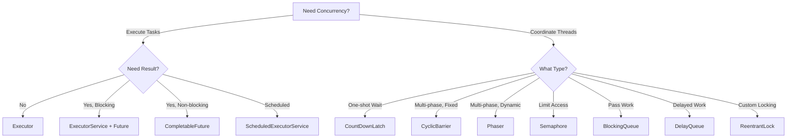

+++
category = ["Java", "100DaysOfJava"]
date = 2025-11-21T00:00:00Z
description = "Master advanced Java concurrency - DelayQueue, ReentrantLock, Phaser with debugging techniques, monitoring patterns, and production readiness checklist."
draft = true
ShowToc = true
TocOpen = true
slug = "posts/java/100DaysOfJava/day97"
summary = "Part 3: Advanced Patterns & Production Readiness - Deep dive into 3 advanced tools plus debugging, monitoring, and going to production"
title = "Day 97: Java Concurrency Toolkit Part 3 - Advanced Patterns & Production Readiness"
[cover]
alt = "day97"
caption = "day97"
image = ""
relative = false
+++

> **Series Navigation:** [Part 1: Foundation & Execution](/posts/java/100DaysOfJava/day95) • [Part 2: Core Synchronization](/posts/java/100DaysOfJava/day96) • [Part 3 (You are here)](#)

**"Mastering concurrency isn't about knowing the tools—it's about knowing when NOT to use them, and debugging them when things go wrong."**

In [Part 1 (Day 95)](/posts/java/100DaysOfJava/day95), we explored **execution patterns**. In [Part 2 (Day 96)](/posts/java/100DaysOfJava/day96), we covered **core synchronization tools**.

Now in **Part 3**, we tackle **advanced patterns** and the critical skills for **production systems**: debugging, monitoring, and operational readiness.

## Series Overview

This is a **3-part series** on Java Concurrency:

**Part 1 (Day 95):** Foundation & Execution
- Executor, ExecutorService, ScheduledExecutorService
- Future, CompletableFuture, CountDownLatch

**Part 2 (Day 96):** Core Synchronization Patterns
- CyclicBarrier, Semaphore, ThreadFactory, BlockingQueue

**Part 3 (Today - Day 97):** Advanced Patterns & Production Readiness
- DelayQueue, ReentrantLock, Phaser
- Debugging, Monitoring, Production Patterns

---

## What We're Covering Today

**Part 3 (Today):** Advanced Patterns & Production Readiness
1. DelayQueue - Time-delayed execution with exponential backoff
2. ReentrantLock - Fine-grained locking control
3. Phaser - Dynamic multi-phase coordination
4. Debugging Concurrent Code
5. Monitoring Concurrent Systems
6. Production Readiness Checklist

---

## Performance Characteristics Reference

| Tool | CPU Overhead | Memory Per Instance | Typical Latency | Best For |
|------|-------------|---------------------|-----------------|----------|
| **DelayQueue** | Medium | ~200 bytes + heap | Milliseconds (granularity) | Scheduled/delayed work |
| **ReentrantLock** | Very Low | ~48 bytes | Nanoseconds | Fine-grained locking |
| **Phaser** | Medium | ~128 bytes + parties | Microseconds | Dynamic phase coordination |

---

## Quick Reference: Part 3 Tools at a Glance

| Tool | TL;DR | Key Gotcha |
|------|-------|------------|
| **DelayQueue** | Queue where items become available after a delay. Perfect for exponential backoff retries. | Unbounded (can grow indefinitely). Requires `Delayed` interface |
| **ReentrantLock** | Explicit locking with timeouts, interruptibility, fair mode. More power than `synchronized`. | Must unlock in `finally` - no automatic unlock on exception |
| **Phaser** | Most advanced - dynamic party registration/deregistration, multiple phases. | Most complex synchronizer. Only use when CountDownLatch/CyclicBarrier won't work |

### Why Part 3 is Different

Parts 1 and 2 covered tools you'll use frequently. Part 3 covers **advanced patterns** you'll use occasionally, plus the **critical operational skills** (debugging, monitoring) you'll use daily in production.

---

## 1. DelayQueue: Exponential Backoff Retry

**TL;DR:** Queue where items become available after a delay. Perfect for retry patterns with exponential backoff. Requires implementing `Delayed` interface. Unbounded - can grow indefinitely.

**The Problem:** HTTP requests to external APIs fail intermittently. You need intelligent retry logic with exponential backoff to avoid overwhelming the failing service.

DelayQueue is perfect for implementing retry mechanisms where tasks should only become available after a specific delay. It handles the timing logic internally, so you don't have to.

**The Solution:** Queue with built-in delay mechanism.

```java
import java.util.concurrent.*;

public class RetryQueue {
    
    static class RetryTask implements Delayed {
        private final String payload;
        private final long triggerTime;
        private final int attemptNumber;
        
        public RetryTask(String payload, long delayMs, int attemptNumber) {
            this.payload = payload;
            this.triggerTime = System.currentTimeMillis() + delayMs;
            this.attemptNumber = attemptNumber;
        }
        
        @Override
        public long getDelay(TimeUnit unit) {
            long diff = triggerTime - System.currentTimeMillis();
            return unit.convert(diff, TimeUnit.MILLISECONDS);
        }
        
        @Override
        public int compareTo(Delayed other) {
            return Long.compare(this.triggerTime, ((RetryTask) other).triggerTime);
        }
        
        public String getPayload() { return payload; }
        public int getAttemptNumber() { return attemptNumber; }
    }
    
    private final DelayQueue<RetryTask> retryQueue;
    private final ExecutorService worker;
    private final int maxRetries;
    
    public RetryQueue(int maxRetries) {
        this.retryQueue = new DelayQueue<>();
        this.worker = Executors.newSingleThreadExecutor(
            new NamedThreadFactory("retry-worker", false, Thread.NORM_PRIORITY)
        );
        this.maxRetries = maxRetries;
    }
    
    public void start() {
        worker.submit(() -> {
            while (!Thread.currentThread().isInterrupted()) {
                try {
                    // Blocks until a task's delay expires
                    RetryTask task = retryQueue.take();
                    
                    System.out.println("Attempting delivery (attempt " + task.getAttemptNumber() + "): " + 
                                     task.getPayload());
                    
                    boolean success = sendWebhook(task.getPayload());
                    
                    if (!success && task.getAttemptNumber() < maxRetries) {
                        // Exponential backoff: 2^attempt seconds
                        long backoffMs = (long) Math.pow(2, task.getAttemptNumber()) * 1000;
                        System.out.println("Delivery failed. Retrying in " + backoffMs + "ms");
                        
                        retryQueue.put(new RetryTask(
                            task.getPayload(),
                            backoffMs,
                            task.getAttemptNumber() + 1
                        ));
                    } else if (success) {
                        System.out.println("Delivery successful!");
                    } else {
                        System.err.println("Max retries exceeded. Giving up.");
                    }
                    
                } catch (InterruptedException e) {
                    Thread.currentThread().interrupt();
                    break;
                }
            }
        });
    }
    
    public void scheduleDelivery(String payload) {
        retryQueue.put(new RetryTask(payload, 0, 1));
    }
    
    private boolean sendWebhook(String payload) {
        // Simulate random failures
        return ThreadLocalRandom.current().nextDouble() > 0.3;
    }
    
    public void shutdown() {
        worker.shutdown();
    }
}
```

**Real-World Enhancement:** In production, I persist the retry queue to Redis so retries survive application restarts.

### Trade-offs and Limitations

**Pros:**
- ✅ Built-in delay mechanism
- ✅ No need for manual timing logic
- ✅ Priority-based on delay time
- ✅ Perfect for retry patterns

**Cons:**
- ❌ Unbounded (can grow indefinitely)
- ❌ Requires implementing Delayed interface
- ❌ Clock-dependent (system time changes affect it)
- ❌ Higher CPU usage than simple queue

**Common Mistakes:**

```java
// ❌ MISTAKE 1: Incorrect getDelay implementation
class BadDelayedTask implements Delayed {
    private long delay;
    
    public long getDelay(TimeUnit unit) {
        return unit.convert(delay, TimeUnit.MILLISECONDS);
        // Wrong! Should return remaining time, not original delay
    }
}

// ✅ CORRECT: Return remaining time
class GoodDelayedTask implements Delayed {
    private final long triggerTime; // Absolute time
    
    public long getDelay(TimeUnit unit) {
        long remaining = triggerTime - System.currentTimeMillis();
        return unit.convert(remaining, TimeUnit.MILLISECONDS);
    }
}

// ❌ MISTAKE 2: Forgetting compareTo
class BadTask implements Delayed {
    public long getDelay(TimeUnit unit) { /*...*/ }
    // Missing compareTo! ClassCastException at runtime
}

// ✅ CORRECT: Implement compareTo
class GoodTask implements Delayed {
    public long getDelay(TimeUnit unit) { /*...*/ }
    
    @Override
    public int compareTo(Delayed other) {
        return Long.compare(
            this.getDelay(TimeUnit.NANOSECONDS),
            other.getDelay(TimeUnit.NANOSECONDS)
        );
    }
}

// ❌ MISTAKE 3: Not handling negative delays
public long getDelay(TimeUnit unit) {
    long remaining = triggerTime - System.currentTimeMillis();
    return unit.convert(remaining, TimeUnit.MILLISECONDS);
    // If triggerTime is in the past, this is negative = available immediately
}

// ✅ CORRECT: This is actually correct behavior!
// Negative delay = task is ready immediately
```

### Production Pattern: Circuit Breaker with Retry

```java
public class CircuitBreakerRetry {
    private final DelayQueue<RetryTask> retryQueue;
    private final AtomicInteger failureCount = new AtomicInteger(0);
    private volatile boolean circuitOpen = false;
    
    public void execute(String request) {
        if (circuitOpen) {
            throw new CircuitOpenException("Circuit is open");
        }
        
        try {
            callExternalService(request);
            failureCount.set(0); // Reset on success
        } catch (Exception e) {
            int failures = failureCount.incrementAndGet();
            
            if (failures >= 5) {
                circuitOpen = true;
                scheduleCircuitReset();
            }
            
            // Schedule retry with exponential backoff
            long delayMs = (long) Math.pow(2, failures) * 1000;
            retryQueue.put(new RetryTask(request, delayMs, failures));
        }
    }
    
    private void scheduleCircuitReset() {
        retryQueue.put(new RetryTask("RESET_CIRCUIT", 30000, 0));
    }
}
```

---

## 2. ReentrantLock: Fine-Grained Control

**TL;DR:** Explicit locking with advanced features: timeouts, interruptibility, fair mode. More powerful than `synchronized` but requires manual unlock in `finally`. Use when you need `tryLock()` or lock status checking.

**The Problem:** Multiple threads need to update a critical resource. The `synchronized` keyword isn't flexible enough, you need timeout support, interruptibility, or conditional locking.

ReentrantLock provides explicit locking with advanced features that `synchronized` doesn't offer. It's more verbose but gives you fine-grained control over lock behavior.

**The Solution:** Explicit locking with advanced features.

```java
import java.util.concurrent.locks.*;
import java.nio.file.*;
import java.util.concurrent.TimeUnit;

public class ConfigurationManager {
    private final Lock configLock = new ReentrantLock(true); // fair lock
    private final Path configFile;
    private String cachedConfig;
    
    public ConfigurationManager(Path configFile) {
        this.configFile = configFile;
    }
    
    public void updateConfig(String newConfig) {
        // Try to acquire lock with timeout
        try {
            if (configLock.tryLock(5, TimeUnit.SECONDS)) {
                try {
                    System.out.println(Thread.currentThread().getName() + " - Updating config...");
                    
                    // Write to file
                    Files.writeString(configFile, newConfig);
                    
                    // Update cache
                    cachedConfig = newConfig;
                    
                    // Simulate some processing
                    Thread.sleep(1000);
                    
                    System.out.println(Thread.currentThread().getName() + " - Config updated");
                    
                } finally {
                    configLock.unlock(); // ALWAYS in finally block
                }
            } else {
                System.err.println(Thread.currentThread().getName() + 
                                 " - Could not acquire lock within 5 seconds");
            }
        } catch (InterruptedException e) {
            Thread.currentThread().interrupt();
            System.err.println(Thread.currentThread().getName() + " - Interrupted while waiting for lock");
        } catch (Exception e) {
            System.err.println("Config update failed: " + e.getMessage());
        }
    }
    
    public String readConfig() {
        configLock.lock();
        try {
            if (cachedConfig == null) {
                cachedConfig = Files.readString(configFile);
            }
            return cachedConfig;
        } catch (Exception e) {
            return "Error reading config";
        } finally {
            configLock.unlock();
        }
    }
    
    // Advanced: Check lock status without blocking
    public boolean isConfigBeingUpdated() {
        return ((ReentrantLock) configLock).isLocked();
    }
}
```

**Why Not synchronized?** Because ReentrantLock gives you:
- `tryLock()` with timeout
- Interruptible lock acquisition
- Fair vs non-fair queueing
- Ability to check lock status

### Trade-offs and Limitations

**Pros:**
- ✅ Timeout support
- ✅ Interruptible lock acquisition
- ✅ Fair vs non-fair modes
- ✅ Can check lock state
- ✅ Condition variables support

**Cons:**
- ❌ More verbose than synchronized
- ❌ Must remember to unlock in finally
- ❌ Easy to create deadlocks if not careful
- ❌ No automatic unlock on exception

**synchronized vs ReentrantLock:**

| Feature | synchronized | ReentrantLock |
|---------|-------------|---------------|
| **Timeout** | ❌ | ✅ tryLock(timeout) |
| **Interruptible** | ❌ | ✅ lockInterruptibly() |
| **Fair mode** | ❌ | ✅ new ReentrantLock(true) |
| **Try without blocking** | ❌ | ✅ tryLock() |
| **Condition variables** | ❌ (wait/notify only) | ✅ newCondition() |
| **Automatic unlock** | ✅ | ❌ (must use finally) |
| **Performance** | Slightly better | Slightly worse |
| **Simplicity** | ✅ | ❌ |

**Common Mistakes:**

```java
// ❌ MISTAKE 1: Forgetting to unlock
lock.lock();
doWork(); // What if this throws?
lock.unlock(); // Never called!

// ✅ CORRECT: Always use try-finally
lock.lock();
try {
    doWork();
} finally {
    lock.unlock(); // Always happens
}

// ❌ MISTAKE 2: Locking in wrong order (deadlock)
// Thread 1
lockA.lock();
lockB.lock(); // Waits for B
// Thread 2
lockB.lock();
lockA.lock(); // Waits for A
// DEADLOCK!

// ✅ CORRECT: Acquire locks in consistent order
Lock first = getLockById(Math.min(idA, idB));
Lock second = getLockById(Math.max(idA, idB));
first.lock();
try {
    second.lock();
    try {
        doWork();
    } finally {
        second.unlock();
    }
} finally {
    first.unlock();
}

// ❌ MISTAKE 3: Not handling lock acquisition failure
if (lock.tryLock()) {
    doWork(); // What if this throws?
    lock.unlock(); // Never called!
}

// ✅ CORRECT: tryLock with try-finally
if (lock.tryLock()) {
    try {
        doWork();
    } finally {
        lock.unlock();
    }
} else {
    // Handle failure to acquire lock
}

// ❌ MISTAKE 4: Ignoring interruption
lock.lockInterruptibly(); // Throws InterruptedException

// ✅ CORRECT: Handle interruption
try {
    lock.lockInterruptibly();
    try {
        doWork();
    } finally {
        lock.unlock();
    }
} catch (InterruptedException e) {
    Thread.currentThread().interrupt();
    // Cleanup and exit
}
```

### Advanced Pattern: Read-Write Lock

```java
public class CachedData {
    private final ReadWriteLock rwLock = new ReentrantReadWriteLock();
    private final Lock readLock = rwLock.readLock();
    private final Lock writeLock = rwLock.writeLock();
    private Map<String, String> cache = new HashMap<>();
    
    public String read(String key) {
        readLock.lock(); // Multiple readers allowed
        try {
            return cache.get(key);
        } finally {
            readLock.unlock();
        }
    }
    
    public void write(String key, String value) {
        writeLock.lock(); // Exclusive access
        try {
            cache.put(key, value);
        } finally {
            writeLock.unlock();
        }
    }
    
    // Upgrade pattern: read -> write (dangerous!)
    public void updateIfNeeded(String key, String newValue) {
        readLock.lock();
        try {
            String current = cache.get(key);
            if (needsUpdate(current, newValue)) {
                // Must release read lock before acquiring write lock
                readLock.unlock();
                writeLock.lock();
                try {
                    // Re-check after acquiring write lock
                    current = cache.get(key);
                    if (needsUpdate(current, newValue)) {
                        cache.put(key, newValue);
                    }
                    // Downgrade: acquire read lock before releasing write
                    readLock.lock();
                } finally {
                    writeLock.unlock();
                }
            }
        } finally {
            readLock.unlock();
        }
    }
}
```

---

## 3. Phaser: Dynamic Multi-Phase Coordination

**TL;DR:** Most advanced synchronizer - supports dynamic party registration/deregistration and multiple phases. Complex but powerful. Only use when CountDownLatch or CyclicBarrier won't work. Common in elastic worker pools.

**The Problem:** ETL pipeline with Extract → Transform → Load phases. Workers can join or leave dynamically based on data volume. CountDownLatch and CyclicBarrier don't support dynamic parties.

Phaser is the most advanced synchronizer in this toolkit. It's more complex than CountDownLatch or CyclicBarrier, but it's the only option when you need dynamic party registration.

**The Solution:** Dynamic phase synchronization with Phaser.

```java
import java.util.concurrent.*;
import java.util.stream.IntStream;

public class ETLPipeline {
    
    static class ETLWorker implements Runnable {
        private final Phaser phaser;
        private final int workerId;
        
        public ETLWorker(Phaser phaser, int workerId) {
            this.phaser = phaser;
            this.workerId = workerId;
            phaser.register(); // Register this worker
        }
        
        @Override
        public void run() {
            try {
                System.out.println("Worker-" + workerId + " - Starting EXTRACT phase");
                Thread.sleep(ThreadLocalRandom.current().nextInt(500, 1500));
                System.out.println("Worker-" + workerId + " - EXTRACT complete");
                
                phaser.arriveAndAwaitAdvance(); // Wait for all workers to finish extract
                
                System.out.println("Worker-" + workerId + " - Starting TRANSFORM phase");
                Thread.sleep(ThreadLocalRandom.current().nextInt(500, 1500));
                System.out.println("Worker-" + workerId + " - TRANSFORM complete");
                
                phaser.arriveAndAwaitAdvance(); // Wait for all workers to finish transform
                
                System.out.println("Worker-" + workerId + " - Starting LOAD phase");
                Thread.sleep(ThreadLocalRandom.current().nextInt(500, 1500));
                System.out.println("Worker-" + workerId + " - LOAD complete");
                
                phaser.arriveAndDeregister(); // Complete and leave
                
            } catch (InterruptedException e) {
                Thread.currentThread().interrupt();
            }
        }
    }
    
    public void runPipeline() throws InterruptedException {
        // Create phaser with 1 party (main thread)
        Phaser phaser = new Phaser(1) {
            @Override
            protected boolean onAdvance(int phase, int registeredParties) {
                System.out.println("\n=== Phase " + phase + " completed. " + 
                                 registeredParties + " parties registered ===\n");
                return false; // Continue to next phase
            }
        };
        
        ExecutorService pool = Executors.newFixedThreadPool(4);
        
        // Start initial workers
        IntStream.range(0, 4).forEach(i -> 
            pool.submit(new ETLWorker(phaser, i))
        );
        
        // Simulate dynamic worker joining mid-process
        Thread.sleep(2000);
        System.out.println("\n>>> NEW WORKER JOINING <<<\n");
        pool.submit(new ETLWorker(phaser, 99));
        
        // Main thread deregisters
        phaser.arriveAndDeregister();
        
        pool.shutdown();
        pool.awaitTermination(1, TimeUnit.MINUTES);
        
        System.out.println("\nETL Pipeline complete!");
    }
}
```

**When to Use Phaser:**
- ✅ Need dynamic party registration
- ✅ More than 2 phases
- ✅ Need to track which phase you're in
- ❌ Simple cases (use CountDownLatch or CyclicBarrier instead)

### Trade-offs and Limitations

**Pros:**
- ✅ Dynamic party registration/deregistration
- ✅ Multiple phases (not limited to 2 like CyclicBarrier)
- ✅ Phase number tracking
- ✅ Callback on phase completion
- ✅ Can terminate phases programmatically

**Cons:**
- ❌ Most complex synchronizer
- ❌ Higher overhead than CountDownLatch/CyclicBarrier
- ❌ Easy to misuse (register/deregister bugs)
- ❌ Harder to reason about

**Common Mistakes:**

```java
// ❌ MISTAKE 1: Forgetting to register
Phaser phaser = new Phaser(1);
pool.submit(() -> {
    // Forgot to call phaser.register()!
    phaser.arriveAndAwaitAdvance(); // IllegalStateException
});

// ✅ CORRECT: Register in constructor or before work
class Worker implements Runnable {
    private final Phaser phaser;
    
    Worker(Phaser phaser) {
        this.phaser = phaser;
        phaser.register(); // Register immediately
    }
    
    public void run() {
        phaser.arriveAndAwaitAdvance(); // OK
    }
}

// ❌ MISTAKE 2: Forgetting to deregister
phaser.register();
doWork();
// Forgot phaser.arriveAndDeregister()
// Phaser waits forever!

// ✅ CORRECT: Always deregister when done
phaser.register();
try {
    doWork();
    phaser.arriveAndAwaitAdvance();
} finally {
    phaser.arriveAndDeregister(); // Always cleanup
}

// ❌ MISTAKE 3: onAdvance returns true too early
Phaser phaser = new Phaser(1) {
    @Override
    protected boolean onAdvance(int phase, int registeredParties) {
        return true; // Terminates immediately!
    }
};

// ✅ CORRECT: Return true only when truly done
protected boolean onAdvance(int phase, int registeredParties) {
    System.out.println("Phase " + phase + " complete");
    return phase >= 2 || registeredParties == 0; // Stop after phase 2
}
```

**Phaser vs CountDownLatch vs CyclicBarrier:**

| Feature | CountDownLatch | CyclicBarrier | Phaser |
|---------|---------------|---------------|---------|
| **Reusable** | ❌ | ✅ | ✅ |
| **Dynamic parties** | ❌ | ❌ | ✅ |
| **Multiple phases** | ❌ | ✅ | ✅ |
| **Phase tracking** | ❌ | ❌ | ✅ |
| **Complexity** | Low | Low | High |
| **Use case** | One-shot wait | Fixed multi-phase | Dynamic multi-phase |

---

## Debugging Concurrent Code

### Reading Thread Dumps

When your application hangs, take a thread dump to see what threads are doing:

**Windows:**
```powershell
# Get PID
jps

# Generate thread dump
jstack <PID> > thread_dump.txt

# Or send Ctrl+Break to console
```

**Linux:**
```bash
kill -3 <PID>  # Sends SIGQUIT, creates thread dump
```

**What to look for in thread dumps:**

```
"payment-worker-1" #23 prio=5 os_prio=0 tid=0x00007f8a2c001000 nid=0x4d2 waiting on condition
   java.lang.Thread.State: WAITING (parking)
        at sun.misc.Unsafe.park(Native Method)
        at java.util.concurrent.locks.LockSupport.park(LockSupport.java:175)
        at java.util.concurrent.locks.AbstractQueuedSynchronizer.parkAndCheckInterrupt
        at java.util.concurrent.CountDownLatch.await(CountDownLatch.java:231)
        at com.example.Service.process(Service.java:45)
```

**Red flags:**
- 🚨 Many threads in WAITING on same object → Likely missed countDown/release
- 🚨 BLOCKED threads with circular waiting → Deadlock
- 🚨 Multiple threads named "pool-1-thread-X" → Need ThreadFactory
- 🚨 Thread doing CPU work for long time → Infinite loop or expensive operation

### Common Deadlock Patterns

#### Pattern 1: Classic Lock Ordering Deadlock

```java
// ❌ DEADLOCK
class Account {
    private final Object lock = new Object();
    
    public void transfer(Account to, double amount) {
        synchronized (this.lock) {              // Thread 1 locks A
            synchronized (to.lock) {             // Thread 1 waits for B
                this.balance -= amount;
                to.balance += amount;
            }
        }
    }
}

// Thread 1: accountA.transfer(accountB, 100);  // Locks A, waits for B
// Thread 2: accountB.transfer(accountA, 50);   // Locks B, waits for A
// DEADLOCK!

// ✅ SOLUTION: Acquire locks in consistent order
public void transfer(Account to, double amount) {
    Account first = System.identityHashCode(this) < System.identityHashCode(to) 
                    ? this : to;
    Account second = first == this ? to : this;
    
    synchronized (first.lock) {
        synchronized (second.lock) {
            if (this != first) {
                // Adjust amounts for reversed order
                to.balance += amount;
                this.balance -= amount;
            } else {
                this.balance -= amount;
                to.balance += amount;
            }
        }
    }
}
```

#### Pattern 2: Nested Lock Acquisition

```java
// ❌ DEADLOCK
class Service {
    private final Lock lock1 = new ReentrantLock();
    private final Lock lock2 = new ReentrantLock();
    
    public void method1() {
        lock1.lock();
        try {
            lock2.lock();  // Acquires lock2 while holding lock1
            try {
                doWork();
            } finally {
                lock2.unlock();
            }
        } finally {
            lock1.unlock();
        }
    }
    
    public void method2() {
        lock2.lock();
        try {
            lock1.lock();  // Acquires lock1 while holding lock2 (OPPOSITE ORDER!)
            try {
                doWork();
            } finally {
                lock1.unlock();
            }
        } finally {
            lock2.unlock();
        }
    }
}

// ✅ SOLUTION: Use tryLock with timeout
public void method2() {
    lock2.lock();
    try {
        if (lock1.tryLock(1, TimeUnit.SECONDS)) {
            try {
                doWork();
            } finally {
                lock1.unlock();
            }
        } else {
            // Failed to acquire lock1 - back off
            throw new TimeoutException("Could not acquire lock");
        }
    } finally {
        lock2.unlock();
    }
}
```

#### Pattern 3: Forgotten CountDownLatch

```java
// ❌ HANGS FOREVER
CountDownLatch latch = new CountDownLatch(3);
pool.submit(() -> {
    doWork();
    if (success) {  // Conditional countdown!
        latch.countDown();
    }
});

latch.await(); // Might wait forever if success=false

// ✅ SOLUTION: Always countDown
pool.submit(() -> {
    try {
        doWork();
    } finally {
        latch.countDown(); // Always happens
    }
});
```

### Detecting Deadlocks Programmatically

```java
public class DeadlockDetector {
    public static void detectDeadlocks() {
        ThreadMXBean threadBean = ManagementFactory.getThreadMXBean();
        long[] deadlockedThreads = threadBean.findDeadlockedThreads();
        
        if (deadlockedThreads != null) {
            ThreadInfo[] threadInfos = threadBean.getThreadInfo(deadlockedThreads);
            
            System.err.println("DEADLOCK DETECTED!");
            for (ThreadInfo info : threadInfos) {
                System.err.println("Thread: " + info.getThreadName());
                System.err.println("Locked on: " + info.getLockName());
                System.err.println("Waiting for: " + info.getLockOwnerName());
                System.err.println("Stack trace:");
                for (StackTraceElement element : info.getStackTrace()) {
                    System.err.println("  " + element);
                }
            }
            
            // In production: alert monitoring system
            alertOps("Deadlock detected!");
        }
    }
}
```

---

## Monitoring Concurrent Systems

### Key Metrics to Track

```java
public class ConcurrencyMetrics {
    private final MeterRegistry registry;
    
    public void setupMetrics(ExecutorService pool, BlockingQueue<?> queue) {
        // Thread pool metrics
        if (pool instanceof ThreadPoolExecutor) {
            ThreadPoolExecutor tpe = (ThreadPoolExecutor) pool;
            
            registry.gauge("threadpool.active", tpe, ThreadPoolExecutor::getActiveCount);
            registry.gauge("threadpool.size", tpe, ThreadPoolExecutor::getPoolSize);
            registry.gauge("threadpool.queue.size", tpe, 
                e -> e.getQueue().size());
            
            // Alert if queue is growing
            registry.gauge("threadpool.queue.utilization", tpe, e -> {
                int queueSize = e.getQueue().size();
                int remainingCapacity = e.getQueue().remainingCapacity();
                return (double) queueSize / (queueSize + remainingCapacity);
            });
        }
        
        // Task execution metrics
        registry.timer("task.execution.time");
        registry.counter("task.completed");
        registry.counter("task.failed");
        
        // Liveness check
        registry.gauge("system.deadlocked.threads", this, 
            m -> countDeadlockedThreads());
    }
    
    private long countDeadlockedThreads() {
        ThreadMXBean threadBean = ManagementFactory.getThreadMXBean();
        long[] deadlocked = threadBean.findDeadlockedThreads();
        return deadlocked != null ? deadlocked.length : 0;
    }
}
```

### Critical Alerts

**Set up alerts for:**

1. **Queue depth > 80% capacity** → Consumers falling behind
   ```java
   if (queueUtilization > 0.8) {
       alert("Queue nearly full - consider scaling consumers");
   }
   ```

2. **All threads busy for > 1 minute** → Thread pool too small
   ```java
   if (activeThreads == poolSize && duration > 60_000) {
       alert("Thread pool saturated - consider increasing size");
   }
   ```

3. **Task duration p99 > SLA** → Performance degradation
   ```java
   if (taskDurationP99 > slaMs) {
       alert("Task latency exceeds SLA");
   }
   ```

4. **Deadlock detected** → Critical failure
   ```java
   if (deadlockedThreads > 0) {
       alert("CRITICAL: Deadlock detected - immediate action required");
   }
   ```

5. **Thread count growing** → Thread leak
   ```java
   if (threadCountDelta > 10 && timeWindow < 60_000) {
       alert("Potential thread leak detected");
   }
   ```

---

## Common Anti-Patterns Across All Tools

### 1. Thread Pool Sizing

```java
// ❌ ANTI-PATTERN: Magic numbers
ExecutorService pool = Executors.newFixedThreadPool(42);

// ✅ CORRECT: Calculate based on workload
int poolSize = Runtime.getRuntime().availableProcessors() * 
               (isCpuBound ? 1 : 2);

// ✅ BETTER: Use formula for I/O-bound
// ThreadCount = NumCores * (1 + WaitTime/ComputeTime)
int poolSize = cores * (1 + (int)(waitTimeMs / computeTimeMs));
```

### 2. Ignoring Shutdown

```java
// ❌ ANTI-PATTERN: No shutdown
public void process() {
    ExecutorService pool = Executors.newFixedThreadPool(10);
    pool.submit(() -> work());
} // Pool leaks!

// ✅ CORRECT: Proper shutdown
public void process() {
    ExecutorService pool = Executors.newFixedThreadPool(10);
    try {
        pool.submit(() -> work()).get();
    } finally {
        pool.shutdown();
        if (!pool.awaitTermination(60, TimeUnit.SECONDS)) {
            pool.shutdownNow();
        }
    }
}
```

### 3. Daemon Threads for Critical Work

```java
// ❌ ANTI-PATTERN: Daemon thread for DB writes
ThreadFactory factory = r -> {
    Thread t = new Thread(r);
    t.setDaemon(true); // JVM can exit before DB write!
    return t;
};

// ✅ CORRECT: Non-daemon for critical work
ThreadFactory factory = r -> {
    Thread t = new Thread(r);
    t.setDaemon(false);
    return t;
};
```

### 4. Unbounded Queues

```java
// ❌ ANTI-PATTERN: Unbounded queue
BlockingQueue<Task> queue = new LinkedBlockingQueue<>(); // Unbounded!

// ✅ CORRECT: Bounded with backpressure
BlockingQueue<Task> queue = new ArrayBlockingQueue<>(1000);
```

### 5. Swallowing Exceptions

```java
// ❌ ANTI-PATTERN: Silent failure
pool.submit(() -> {
    riskyOperation(); // Exception swallowed!
});

// ✅ CORRECT: Explicit error handling
pool.submit(() -> {
    try {
        riskyOperation();
    } catch (Exception e) {
        logger.error("Task failed", e);
        errorTracker.captureException(e);
    }
});
```

---

## Integration Example: Complete Concurrent Pipeline

Let's combine multiple tools to build a realistic image processing pipeline:

```java
public class ProductionImagePipeline {
    private final ExecutorService downloadPool;
    private final ExecutorService processPool;
    private final BlockingQueue<ImageTask> downloadQueue;
    private final BlockingQueue<ImageTask> processQueue;
    private final Semaphore rateLimiter;
    private final MeterRegistry metrics;
    
    public ProductionImagePipeline(MeterRegistry metrics) {
        this.metrics = metrics;
        
        // Custom thread factories for debugging
        this.downloadPool = Executors.newFixedThreadPool(10,
            new NamedThreadFactory("image-downloader", false, Thread.NORM_PRIORITY));
        this.processPool = Executors.newFixedThreadPool(4,
            new NamedThreadFactory("image-processor", false, Thread.NORM_PRIORITY));
        
        // Bounded queues for backpressure
        this.downloadQueue = new ArrayBlockingQueue<>(100);
        this.processQueue = new ArrayBlockingQueue<>(50);
        
        // Rate limiter: 10 downloads per second
        this.rateLimiter = new Semaphore(10, true);
        
        // Setup monitoring
        setupMetrics();
    }
    
    public CompletableFuture<ProcessedImage> process(String imageUrl) {
        return CompletableFuture
            .supplyAsync(() -> downloadWithRetry(imageUrl), downloadPool)
            .thenApplyAsync(image -> processImage(image), processPool)
            .exceptionally(ex -> {
                metrics.counter("pipeline.failed").increment();
                logger.error("Pipeline failed for " + imageUrl, ex);
                return null;
            });
    }
    
    private RawImage downloadWithRetry(String url) {
        // Use DelayQueue pattern for retry
        int attempt = 0;
        while (attempt < 3) {
            try {
                // Rate limiting with semaphore
                rateLimiter.acquire();
                try {
                    return download(url);
                } finally {
                    rateLimiter.release();
                }
            } catch (Exception e) {
                attempt++;
                if (attempt >= 3) throw e;
                
                long backoff = (long) Math.pow(2, attempt) * 1000;
                Thread.sleep(backoff);
            }
        }
        throw new RuntimeException("Max retries exceeded");
    }
    
    private void setupMetrics() {
        metrics.gauge("queue.download.size", downloadQueue, BlockingQueue::size);
        metrics.gauge("queue.process.size", processQueue, BlockingQueue::size);
        metrics.gauge("ratelimiter.available", rateLimiter, 
            Semaphore::availablePermits);
    }
    
    public void shutdown() {
        downloadPool.shutdown();
        processPool.shutdown();
        try {
            downloadPool.awaitTermination(60, TimeUnit.SECONDS);
            processPool.awaitTermination(60, TimeUnit.SECONDS);
        } catch (InterruptedException e) {
            downloadPool.shutdownNow();
            processPool.shutdownNow();
        }
    }
}
```

---

## Production Readiness Checklist

Before deploying concurrent code:

### Resource Management
- [ ] All thread pools have bounded queues
- [ ] Proper shutdown handlers registered
- [ ] Timeouts set on all blocking operations
- [ ] Thread pool sizes calculated, not guessed

### Observability
- [ ] Thread pools have meaningful names (ThreadFactory)
- [ ] Queue depths monitored
- [ ] Task execution times tracked
- [ ] Deadlock detection enabled
- [ ] Exception handlers log to monitoring system

### Error Handling
- [ ] All Future.get() calls have timeouts
- [ ] Exceptions in async tasks are logged
- [ ] Circuit breakers on external calls
- [ ] Retry logic with exponential backoff

### Testing
- [ ] Load tests with concurrent users
- [ ] Chaos engineering (kill threads mid-execution)
- [ ] Thread dump analysis under load
- [ ] Memory profiling for leaks

---

## Complete Toolkit Summary (All 3 Parts)

### Execution Tools (Part 1 - Day 95)
- **Executor** → Fire-and-forget tasks
- **ExecutorService** → Managed thread pools
- **ScheduledExecutorService** → Periodic execution
- **Future** → Blocking result retrieval
- **CompletableFuture** → Non-blocking async pipelines
- **CountDownLatch** → One-shot coordination

### Synchronization Tools (Part 2 - Day 96)
- **CyclicBarrier** → Multi-phase checkpoints
- **Semaphore** → Resource limiting
- **ThreadFactory** → Thread customization
- **BlockingQueue** → Producer-consumer

### Advanced Tools (Part 3 - Today)
- **DelayQueue** → Delayed execution
- **ReentrantLock** → Custom locking
- **Phaser** → Dynamic multi-phase

---

## Choosing the Right Tool: Decision Tree



---

## Key Principles I've Learned

### 1. Always Set Timeouts
Every `Future.get()`, every `Semaphore.acquire()`, every `Lock.lock()`. Blocking forever is how systems hang in production.

### 2. Name Your Threads
Thread dumps with "pool-1-thread-17" make debugging nearly impossible. Custom `ThreadFactory` for meaningful names is worth the effort.

### 3. Monitor Queue Depths
A growing `BlockingQueue` signals that consumers can't keep up with producers. This is your early warning system.

### 4. Graceful Shutdown is Hard
Proper shutdown sequence: call `shutdown()`, then `awaitTermination()`, then `shutdownNow()` if needed. This is easy to get wrong.

### 5. Beware of Daemon Threads
Daemon threads die when the JVM exits. If they're doing critical work (like flushing logs), they need to be non-daemon.

### 6. Fair vs Unfair Locks Matter
Unfair locks have better throughput but can cause starvation. Choose based on your requirements.

### 7. Bounded Resources Prevent Cascading Failures
Unbounded queues and thread pools can cause OOM. Always set limits.

### 8. Composition Over Complexity
Start simple (CountDownLatch), only use complex tools (Phaser) when truly needed.

---

## When NOT to Use These Tools

Before reaching for concurrency, ask:

❌ **Don't use if:**
- Sequential processing takes < 100ms
- Task is inherently sequential (B depends on A)
- Dataset is small (< 1000 items)
- Debugging complexity outweighs performance gain
- Team lacks concurrency expertise

✅ **Do use if:**
- I/O-bound operations (network, disk, DB)
- Independent tasks that can parallelize
- Need to keep UI/API responsive
- Processing large datasets
- Proven bottleneck exists

**Golden Rule:** Measure first. Optimize second. Add concurrency only when there's clear benefit.

---

## Understanding the Complete Toolkit

Over these three parts, we've explored **13 essential concurrency tools**. I've used some extensively in production (ExecutorService, Future, CountDownLatch, ReentrantLock), while others (Phaser, DelayQueue) I'm still mastering.

**The real insight:** Concurrency isn't about raw speed. It's about **structuring your system to handle multiple concerns elegantly and safely**.

Each tool solves a specific problem:
- Need to execute? → ExecutorService
- Need to wait? → CountDownLatch / CyclicBarrier / Phaser
- Need to limit? → Semaphore
- Need to pass work? → BlockingQueue
- Need to delay? → DelayQueue / ScheduledExecutorService
- Need custom locking? → ReentrantLock

The skill is **knowing which tool fits your use case**. That's what these 13 tools teach us.

---

## What's Next?

This completes our deep dive into `java.util.concurrent`. But there's more to learn:

- **Virtual Threads (Java 19+)** - Lightweight threads that change the concurrency model
- **Reactive Streams** - Async streams with backpressure (Project Reactor, RxJava)
- **Fork/Join Framework** - Recursive parallelism for divide-and-conquer
- **Parallel Streams** - When and when not to use them
- **Structured Concurrency (Preview)** - Better async task management

Next time you're tempted to spawn a raw `Thread`, ask yourself: **which of these 13 patterns actually fits my use case?**

That's the question I'm learning to answer.

---

**Previous:** [Day 96 - Java Concurrency Toolkit Part 2: Core Synchronization Patterns](/posts/java/100DaysOfJava/day96)

*What concurrency challenges have you faced in production? Which debugging techniques have saved you? Drop a comment below!*

