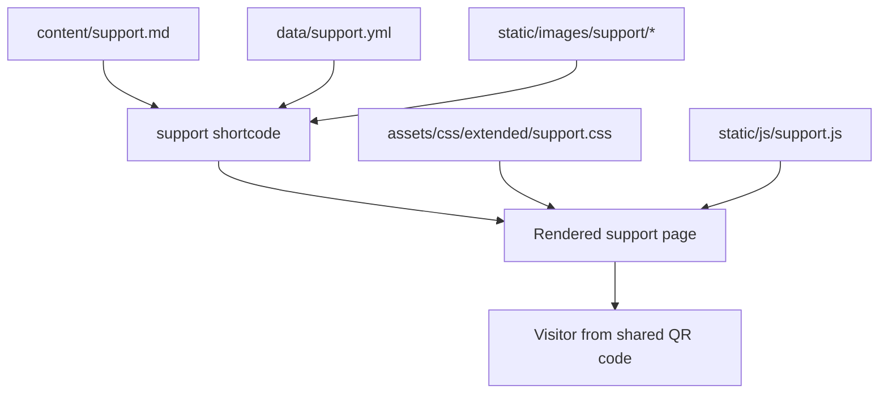

# Support Page QR Landing Redesign

## Summary

Redesign `content/support.md` into a polished, mobile-first support landing page for visitors who arrive from a shared QR code. The page should stay coherent with the existing PaperMod-based personal site, render payment/support methods from configurable data, and avoid publishing private payment details unless they are intentionally public.

## Problem Frame

The current support page works, but its HTML, JavaScript, payment copy, bank details, and QR generation URLs all live directly inside `content/support.md`. That makes the page hard to maintain, easy to accidentally expose sensitive details, and visually constrained by repeated cards. The QR-entry use case needs a clearer first screen: visitors should immediately understand who they are supporting, why, and which safe payment method to use.

## Requirements

**QR landing experience**

- R1. The first mobile viewport must work as the primary experience for people arriving from a QR scan: name, intent, preferred support methods, and contact fallback should all be visible or one tap away.
- R2. The page must feel like part of the current site: use PaperMod tokens, the existing 8px radius, automatic light/dark theme behavior, and the site's restrained personal-blog tone.
- R3. The layout must avoid brittle fixed widths and must remain readable on narrow phone screens, tablets, and the current 720px content column.

**Configurable support methods**

- R4. Payment/support providers must be rendered from a data source rather than being hard-coded into the page markup.
- R5. The content model must support bank transfer, mobile wallet, external support links, email/contact fallback, profile links, and optional local QR images.
- R6. Missing or intentionally private fields must render as clear fallback states, not broken empty rows or disabled-looking dead controls.

**Security and privacy**

- R7. The implementation must treat every value rendered into the static site as public. Private phone numbers, personal account numbers, and non-public payment identifiers must stay out of the repo and built HTML.
- R8. QR images for payment methods must be local/static assets or provider-hosted public links. The page must not call a third-party QR generator with payment data at runtime.
- R9. Copy actions must use safe client-side behavior with visible feedback and a manual fallback when clipboard access fails.

**Accessibility and trust**

- R10. Tabs, copy buttons, QR dialogs, and support links must be keyboard accessible, screen-reader understandable, and contrast-safe in light and dark themes.
- R11. External links must use safe `target="_blank"` handling, and the page must clearly distinguish public support methods from private/contact-only methods.

## Key Technical Decisions

- **Use a Hugo data file for support metadata:** Store public support methods in `data/support.yml` so bank, wallet, link, email, and QR fields can change without editing the markup. This removes hard-coded payment content from `content/support.md` while keeping the static-site model simple.
- **Render with a dedicated shortcode:** Replace the large raw HTML body in `content/support.md` with a support shortcode. `layouts/shortcodes/support.html` should own the markup and read from `.Site.Data.support`.
- **Move behavior into an external script:** Put tab switching, copy feedback, and QR dialog behavior in `static/js/support.js` instead of inline page JavaScript. This improves maintainability and is a better CSP posture.
- **Keep styling in the existing extended CSS hook:** Continue using `assets/css/extended/support.css`, because PaperMod already picks up extended CSS and the page already has a scoped support stylesheet.
- **Do not promise secrecy on a static page:** Hugo cannot safely hide payment details once rendered. The plan explicitly separates "public and rendered" values from "private and contact-only" values instead of pretending client-side masking is security.
- **Use local QR assets for payment QR codes:** Store intentionally public QR images under `static/images/support/` and reference them from the data file. This avoids leaking payment payloads to QR-generator APIs and avoids broken generated URLs.

## High-Level Technical Design

The page should use the current site shell and content width, then introduce a richer internal composition:

- A compact hero with Mohibul's name, support intent, and two primary actions.
- A "preferred support" strip for the most useful methods after a QR scan.
- Grouped payment sections driven by data: local, international, contact-only, and profiles.
- A trust note explaining that some details are intentionally private and available by email.
- A modal or inline reveal for public QR images only.

## Implementation Units

### U1. Support Data Model

- **Goal:** Introduce a structured public data source for support methods and page copy.
- **Files:** `data/support.yml`
- **Patterns:** Follow the existing Hugo data directory pattern already used by `data/java_graph_overrides.json`; keep values public by default.
- **Test Scenarios:**
  - Data contains multiple method types and the page can render each type without page-markup edits.
  - A method with no `accountNumber` or no `qrImage` renders a useful fallback.
  - Private values are represented as contact-only text, not placeholder secrets.
- **Verification:** Hugo build succeeds and no private-only placeholder value is emitted into `public/support/index.html`.

### U2. Support Shortcode

- **Goal:** Replace raw support markup with a Hugo-rendered shortcode that consumes `data/support.yml`.
- **Files:** `content/support.md`, `layouts/shortcodes/support.html`
- **Patterns:** Keep `content/support.md` focused on front matter and shortcode invocation, similar to other content pages that delegate rendering to Hugo components.
- **Test Scenarios:**
  - `/support/` renders the hero, method groups, trust note, and profile/contact links from data.
  - Each payment method has the correct link, copy control, privacy state, and QR state.
  - The page renders correctly when a group has one item or no public QR image.
- **Verification:** Build output contains no raw shortcode syntax and no duplicate page heading conflicts.

### U3. Interaction Script

- **Goal:** Move client-side behavior out of inline HTML and make it resilient.
- **Files:** `static/js/support.js`, `layouts/shortcodes/support.html`
- **Patterns:** Mirror the static-script approach already used by `static/js/java-graph.js`; initialize behavior from `data-*` attributes rather than inline event handlers.
- **Test Scenarios:**
  - Copy button writes the configured value and announces success.
  - Clipboard failure shows manual-copy feedback without breaking the page.
  - QR dialog opens only when a public QR image exists, closes by button, overlay click, and Escape.
  - Tabs or segmented filters update visible groups while preserving keyboard access.
- **Verification:** No `onclick` handlers remain in `content/support.md` or the shortcode.

### U4. Visual Redesign

- **Goal:** Make the page feel intentionally designed while staying native to the blog.
- **Files:** `assets/css/extended/support.css`
- **Patterns:** Preserve PaperMod variables from `themes/hugo-PaperMod/assets/css/core/theme-vars.css`; use scoped `.support-*` selectors; avoid nested cards and oversized marketing hero treatment.
- **Test Scenarios:**
  - Mobile first viewport shows identity, intent, and primary support actions without horizontal scrolling.
  - Light and dark themes both pass readable contrast for body text, labels, buttons, and disabled/private states.
  - Long account names, links, tags, or branch names wrap cleanly.
  - Buttons and touch targets stay at least 40px tall.
- **Verification:** Browser review at phone, tablet, and desktop widths.

### U5. Tests and Build Verification

- **Goal:** Update smoke coverage to match the data-driven page and privacy boundary.
- **Files:** `tests/support-page-smoke.ps1`
- **Patterns:** Keep the current PowerShell smoke-test style, but assert structural/data-driven behavior instead of requiring specific hard-coded bank values.
- **Test Scenarios:**
  - `content/support.md` invokes the shortcode and no longer embeds bank rows directly.
  - `data/support.yml` contains required fields for visible support methods.
  - `assets/css/extended/support.css` contains responsive support layout rules.
  - `static/js/support.js` contains clipboard and QR-dialog initialization hooks.
  - Build output does not include known private placeholders or disabled runtime QR-generator URLs.
- **Verification:** Run the smoke test and a Hugo build after implementation.

## Scope Boundaries

- The implementation does not add authentication or a private payment portal. A static Hugo page cannot securely reveal secrets to selected users.
- The implementation does not add a backend payment processor. External support links and public static payment QR images are in scope.
- The implementation does not redesign the whole PaperMod theme. Styling stays scoped to the support page.
- The implementation does not publish private bKash, bank, or other payment data unless those values are deliberately placed in the public data file.

## Acceptance Examples

- AE1. Given a visitor scans the shared QR code on a phone, when `/support/` opens, then they see Mohibul's name, a short support explanation, and preferred support methods without needing desktop layout.
- AE2. Given a support method has a public QR image path, when the visitor taps its QR control, then a modal opens with the local image and closes accessibly.
- AE3. Given a support method is contact-only, when the page renders, then the method explains how to request details instead of showing fake, disabled, or hidden account values.
- AE4. Given clipboard access is unavailable, when the visitor taps Copy, then the page gives a manual-copy fallback instead of failing silently.
- AE5. Given the site is built for production, when the generated support HTML is inspected, then payment values appear only if they were intentionally placed in public support data.

## Risks and Dependencies

- **Static-site privacy risk:** Any rendered payment value is public. Mitigation: treat `data/support.yml` as public content and keep private payment details out of it.
- **QR asset lifecycle:** Local QR images must be manually updated if payment providers rotate QR codes. Mitigation: name assets clearly by provider and keep the data file as the update point.
- **Existing untracked tests/docs:** `docs/` and `tests/` are currently untracked in the worktree. Implementation should avoid treating that as permission to remove or rewrite unrelated files.
- **Third-party provider changes:** External support URLs can change. Mitigation: make URLs data-driven and keep email as a stable fallback.

## Sources and Existing Patterns

- `content/support.md` currently owns page content, payment details, inline JavaScript, and raw support markup.
- `assets/css/extended/support.css` already scopes support-page styling and uses PaperMod variables.
- `themes/hugo-PaperMod/assets/css/core/theme-vars.css` defines the site's light/dark theme tokens and `--radius`.
- `config.yml` already exposes `/support/` in the main navigation.
- `tests/support-page-smoke.ps1` already covers the support page, but should be updated to the new data-driven contract.
