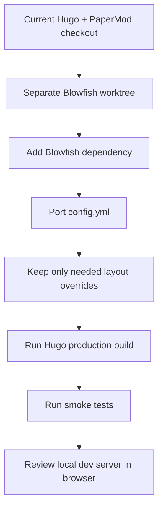

# Integrate Blowfish Text-First in a Separate Worktree

## Summary

Move the site from PaperMod to Blowfish in an isolated worktree, keeping Hugo and the existing content model intact. The migration targets a reader-first blog with a cleaner profile/showcase landing page, not an image-heavy portfolio rebuild.

---

## Problem Frame

The current site already works as a Hugo blog, but PaperMod is optimized for a minimal post list more than a personal landing page. The desired direction is closer to a readable editorial site that also lets visitors understand Mohibul's skills, writing areas, Java learning work, projects, resume, and contact paths from the homepage.

---

## Requirements

- R1. The implementation happens in a separate git worktree so the current checkout stays usable.
- R2. Hugo remains the framework and existing Markdown content remains the source of truth.
- R3. Blowfish is configured in a text-first mode with minimal image reliance.
- R4. The homepage presents Mohibul's identity, featured writing, `100DaysOfJava`, projects, resume, and contact paths.
- R5. Blog posts preserve reader basics: reading time, code copy, syntax highlighting, post navigation, RSS, Atom, and share controls where Blowfish supports them cleanly.
- R6. Existing custom pages keep working, especially the support page and Java knowledge graph.
- R7. Local verification covers a production Hugo build and a browser pass against the local dev server.

---

## Key Technical Decisions

- **Keep Hugo:** The site is already Hugo-based, content-heavy, and deployed as static output, so changing framework would add migration work without solving the current problem.
- **Use Blowfish as a theme dependency:** This keeps the migration close to the current PaperMod setup and avoids building a custom theme before a real limitation appears.
- **Prefer submodule-style theme installation:** The repo already tracks Hugo themes through `.gitmodules`, so using the same pattern is less surprising than introducing Hugo modules.
- **Configure before overriding templates:** Start with Blowfish config and theme params; copy or override layouts only when existing behavior breaks.
- **Keep the homepage text-first:** The landing page should sell skill and writing clarity through structure and typography, not missing hero images.

---

## Scope Boundaries

- Do not rewrite the content archive during the theme migration.
- Do not build a custom Ciechanowski-style article engine yet.
- Do not add image-generation, animation libraries, or a JavaScript design layer for the homepage.
- Do not remove PaperMod until the Blowfish worktree builds and local review passes.

---

## Implementation Units

### U1. Isolated Worktree and Theme Dependency

- **Goal:** Create the migration branch in a separate worktree and add Blowfish without changing the current checkout.
- **Files:** `.gitmodules`, `themes/blowfish`
- **Patterns:** Follow the existing `themes/hugo-PaperMod` submodule pattern.
- **Test Scenarios:** Confirm the original worktree remains on its current branch and the Blowfish branch contains the new theme dependency only.
- **Verification:** `git status --short --branch` in both worktrees shows separated branch state.

### U2. Blowfish Configuration Port

- **Goal:** Convert the PaperMod-specific `config.yml` settings to Blowfish equivalents while preserving site identity, menu entries, feeds, analytics, favicon assets, and Markdown rendering.
- **Files:** `config.yml`
- **Patterns:** Preserve existing top-level Hugo settings, `menu.main`, `outputs`, `mediaTypes`, and `markup.highlight` unless Blowfish requires different names.
- **Test Scenarios:** The home page renders, `/blog/` or the configured post list renders, RSS/Atom output still exists, and the resume/support menu links remain visible.
- **Verification:** A production Hugo build completes without missing-template or missing-param errors.

### U3. Text-First Homepage Showcase

- **Goal:** Configure Blowfish's homepage to introduce Mohibul and surface featured writing, `100DaysOfJava`, projects, resume, and contact paths without needing image cards.
- **Files:** `config.yml`, `content/about.md`, `content/projects.md`
- **Patterns:** Reuse existing content first; only edit page copy when a short homepage summary needs a cleaner source.
- **Test Scenarios:** A first-time visitor can identify the author, technical focus, writing areas, showcase links, and contact path from the first page.
- **Verification:** Browser review at the local dev URL on desktop and mobile widths.

### U4. Custom Layout Compatibility

- **Goal:** Keep repo-specific custom behavior working after the theme switch.
- **Files:** `layouts/_partials/extend_head.html`, `layouts/_partials/extend_footer.html`, `layouts/_partials/extend_post_content.html`, `layouts/knowledge-graph/single.html`, `layouts/partials/java_graph/add_edge.html`, `layouts/partials/java_graph/classify_topic.html`, `layouts/partials/java_graph/node_id.html`, `layouts/partials/java_graph/normalize_link.html`, `layouts/shortcodes/replit.html`, `layouts/_shortcodes/blockquote.html`
- **Patterns:** Keep custom layouts only where Hugo resolves them above the theme and they still match Blowfish's partial names.
- **Test Scenarios:** Analytics/custom head content renders, the Java knowledge graph page renders, and existing shortcodes do not break article builds.
- **Verification:** Production build plus browser checks for the homepage, one article, support page, and Java graph page.

### U5. Support and Static Asset Check

- **Goal:** Preserve the current support page styling and Java graph assets under Blowfish.
- **Files:** `assets/css/extended/support.css`, `static/css/java-graph.css`, `static/js/java-graph.js`, `content/support.md`
- **Patterns:** Keep existing CSS/JS paths unless Blowfish requires a different asset injection hook.
- **Test Scenarios:** Support tabs, QR modal, copy helpers, payment details, and Java graph assets still load locally.
- **Verification:** Run `tests/support-page-smoke.ps1` and browser-check `/support/`.

### U6. Local Verification Harness

- **Goal:** Leave one small repeatable check for the theme migration.
- **Files:** `tests/blowfish-theme-smoke.ps1`
- **Patterns:** Match the simple assertion style in `tests/support-page-smoke.ps1`.
- **Test Scenarios:** Assert `config.yml` references Blowfish, the Blowfish theme folder exists, key menu entries remain, and a local production build has generated homepage, feed, support page, and at least one post output.
- **Verification:** Run the new smoke test after `hugo --gc --minify` and before visual review.

---

## High-Level Technical Design

---

## Risks and Dependencies

- Blowfish may use different parameter names than PaperMod, so some `params` entries may silently stop affecting the UI.
- Existing `layouts/_partials` overrides may not map to Blowfish partial hooks and may need relocation.
- The repo has a dirty tree with untracked `docs/` and `tests/`, so implementation should avoid staging unrelated work.
- Installing Blowfish requires network access unless the theme already exists locally.

---

## Acceptance Examples

- AE1. Given the original checkout is open, when the Blowfish migration starts, then the implementation happens on a separate worktree and branch.
- AE2. Given the Blowfish branch is built locally, when Hugo renders the site, then homepage, posts, feeds, support page, resume link, and Java graph routes produce output.
- AE3. Given the local server is open, when a visitor lands on the homepage, then they can understand Mohibul's skills, writing topics, Java series, projects, and contact path without relying on images.
- AE4. Given a long technical article is opened, when it is read on desktop and mobile widths, then typography, code blocks, reading time, and navigation remain comfortable.

---

## Sources

- `config.yml`
- `.gitmodules`
- `netlify.toml`
- `README.md`
- `layouts/_partials/extend_head.html`
- `layouts/_partials/extend_footer.html`
- `layouts/_partials/extend_post_content.html`
- `layouts/knowledge-graph/single.html`
- `assets/css/extended/support.css`
- `tests/support-page-smoke.ps1`
